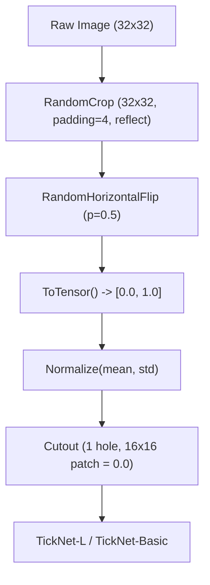

# TickNets: Efficient Lightweight Networks with Full-Residual PDP Blocks for CIFAR-10 & CIFAR-100

[](https://pytorch.org/)
[](https://pytorch.org/)
[-brightgreen.svg)](tests/)
[](https://github.com/khuonglaptri3/TickNets/tree/feature/final-exam-model-l)
[](https://doi.org/10.1016/j.neucom.2024.127942)
[](LICENSE)

> **Original Research Paper:** *Efficient tick-shape networks of full-residual point-depth-point blocks for image classification*  
> **Authors:** Thanh Tuan Nguyen and Thanh Phuong Nguyen (*Neurocomputing*, Volume 596, 2024, Article 127942)  
> **Paper DOI:** [https://doi.org/10.1016/j.neucom.2024.127942](https://doi.org/10.1016/j.neucom.2024.127942) — See [BibTeX Citation](#8-original-paper-abstract--citation)

---

## 1. Project Overview & Final Exam Objectives

This repository contains the official codebase and experimental framework for the **Deep Learning Final Examination**. The project focuses on designing, training, and benchmarking a lightweight Convolutional Neural Network architecture—designated as **TickNet-L v1**—and comparing it directly against the author's original **TickNet-Basic** baseline.

### 1.1. Core Examination Requirements & Constraints
* **Model Budget Compliance:**
  * **Learnable Parameters:** Strictly capped at $\le 6,000,000$ (6M parameters).
  * **Computational Cost (FLOPs forward):** Strictly capped at $< 1,000,000,000$ (1G FLOPs per $32 \times 32$ image).
* **Datasets:** Full evaluation on **CIFAR-10** (10 classes) and **CIFAR-100** (100 classes).
* **Training Protocol:**
  * **Train from Scratch (100%):** No pretrained weights or midterm transfer learning checkpoints.
  * **Hyperparameter Grid Search:** Systematically explore **SGD** (learning rates 0.10, 0.15 with Nesterov momentum) and **Adam** (learning rates 0.001, 0.0003).
  * **Data Regularization:** Standard CIFAR preprocessing combined with **Cutout (16×16 patch)** according to the seminal work by *DeVries & Taylor (2017)*.
* **Evaluation Criteria:**
  * Performance on CIFAR-10 Test Set (30% grade weight).
  * Performance on CIFAR-100 Test Set (30% grade weight).
  * Oral Examination Q&A defense (30% grade weight).
  * Technical Report PDF quality (10% grade weight).

---

## 2. Architecture & Methodology: TickNet-L v1 vs. Author Baseline

The foundational architecture is derived from the **Full-Residual Point-Depth-Point (FR-PDP)** block with a "tick-shaped" (check mark) channel elasticity design. 

```text
                     +---------- Shortcut Identity / Linear PW 1x1 ----------+
                     |                                                        |
Input (Cin) -> Linear PW 1x1 (hidden = 0.75*Cin) 
            -> Split channels (50% DW 3x3, 50% DW 5x5) 
            -> Concat -> BN + ReLU 
            -> PW 1x1 (Cout) + BN + ReLU 
            -> Squeeze-and-Excitation (SE Attention, r=16) 
            -> Element-wise Add (+) -> Output (Cout)
```

### 2.1. Key Architectural Innovations in TickNet-L v1 ([`models/ticknet_l.py`](models/ticknet_l.py))
1. **Downscaled Stem Convolution:** Initial stem uses 24 channels (reduced from 32 in Basic) with stride 1, conserving computational budget at the largest spatial resolution ($32 \times 32$).
2. **Rebalanced 5-Stage Elasticity:** Channel allocation reconfigured to `[112, 64, 144, 288, 512]` to invest representational capacity in deeper stages.
3. **Increased Depth (7 Blocks):** Stage block counts increased to `[1, 1, 2, 2, 1]` (compared to 5 blocks `[1, 1, 1, 1, 1]` in Basic), enhancing non-linear capacity at compact spatial scales ($16 \times 16$ and $8 \times 8$).
4. **Pointwise Bottlenecking:** First pointwise convolution shrinks input channels to `hidden = floor((0.75 * Cin + 4) / 8) * 8`, saving ~25% matrix multiply FLOPs.
5. **Multi-Scale Mixed Depthwise Convolutions:** Stages 3–5 split channels into two equal parallel paths processed by $3 \times 3$ and $5 \times 5$ depthwise kernels, expanding effective receptive fields without expanding FLOPs.
6. **Compact Head & Classification:** Final pointwise reduction uses 768 channels (reduced from 1024 in Basic) followed by Adaptive Average Pooling and a $1 \times 1$ convolution classifier head.

### 2.2. Complexity Profile & Mathematical Budget Verification

Evaluated strictly using the independent profiling tool [`models/model_profile.py`](models/model_profile.py) ($1 \text{ MAC} = 2 \text{ FLOPs}$, batch size = 1, shape = `(1, 3, 32, 32)`):

| Architecture | Dataset | Learnable Params | Param Budget ($\le 6\text{M}$) | Forward FLOPs | FLOPs Budget ($< 1\text{G}$) | Compliance Status |
| :--- | :--- | :---: | :---: | :---: | :---: | :---: |
| **Author TickNet-Basic** | **CIFAR-10** | 1,067,348 | 17.8% | 0.1584 GFLOPs | 15.8% | **PASSED** |
| **Author TickNet-Basic** | **CIFAR-100** | 1,159,598 | 19.3% | 0.1586 GFLOPs | 15.9% | **PASSED** |
| **Proposed TickNet-L v1** | **CIFAR-10** | **1,100,105** | **18.3%** | **0.1578 GFLOPs** | **15.8%** | **PASSED** |
| **Proposed TickNet-L v1** | **CIFAR-100** | **1,169,315** | **19.5%** | **0.1580 GFLOPs** | **15.8%** | **PASSED** |

### 2.3. PyTorch Summary: Stage-by-Stage Parameter & FLOPs Breakdown (CIFAR-10)

Inspect the exact internal parameter allocation using PyTorch forward hooks via [`checkmodel.py`](checkmodel.py) (`python checkmodel.py`):

| Stage / Submodule | Author TickNet-Basic (Shape / Params / FLOPs) | Proposed TickNet-L v1 (Shape / Params / FLOPs) | Key Architectural Shift |
| :--- | :--- | :--- | :--- |
| **`backbone.data_bn`** | `(1, 3, 32, 32)` / **6** (0.00%) / 0 | `(1, 3, 32, 32)` / **6** (0.00%) / 0 | Input batch normalization |
| **`backbone.init_conv`** | `(1, 32, 32, 32)` / **928** (0.09%) / 1.77M | `(1, 24, 32, 32)` / **696** (0.06%) / 1.33M | Channels 32 $\rightarrow$ 24 (saves early FLOPs) |
| **`backbone.stage1`** | `(1, 128, 32, 32)` / **12,264** (1.15%) / 19.47M | `(1, 112, 32, 32)` / **8,351** (0.76%) / 12.64M | Bottleneck ratio 0.75, channels 128 $\rightarrow$ 112 |
| **`backbone.stage2`** | `(1, 64, 32, 32)` / **35,012** (3.28%) / 69.47M | `(1, 64, 32, 32)` / **24,460** (2.22%) / 48.02M | Bottleneck ratio 0.75 (saves ~21.4M FLOPs) |
| **`backbone.stage3`** | `(1, 128, 16, 16)` / **23,880** (2.24%) / 17.08M | `(1, 144, 16, 16)` / **60,850** (5.53%) / 32.47M | 1 block $\rightarrow$ 2 blocks, Mixed DW ($3\times 3 + 5\times 5$) |
| **`backbone.stage4`** | `(1, 256, 8, 8)` / **92,816** (8.70%) / 16.94M | `(1, 288, 8, 8)` / **243,580** (22.14%) / 34.38M | 1 block $\rightarrow$ 2 blocks, Mixed DW ($3\times 3 + 5\times 5$) |
| **`backbone.stage5`** | `(1, 512, 4, 4)` / **365,856** (34.28%) / 16.92M | `(1, 512, 4, 4)` / **359,720** (32.70%) / 16.40M | Mixed DW ($3\times 3 + 5\times 5$), channels 512 |
| **`backbone.final_conv`** | `(1, 1024, 4, 4)` / **526,336** (49.31%) / 16.78M | `(1, 768, 4, 4)` / **394,752** (35.88%) / 12.58M | Channels 1024 $\rightarrow$ 768 (saves 131.6k params) |
| **`backbone.global_pool`**| `(1, 1024, 1, 1)` / **0** / 0 | `(1, 768, 1, 1)` / **0** / 0 | Adaptive Average Pooling |
| **`classifier`** | `(1, 10)` / **10,250** (0.96%) / 0 | `(1, 10)` / **7,690** (0.70%) / 0 | Conv $1\times 1$ classifier head |
| **TOTAL** | **1,067,348 Params** (100%) / **0.1584 GFLOPs** | **1,100,105 Params** (100%) / **0.1578 GFLOPs** | Capacity reinvested into Stages 3 & 4 |

#### Transition to CIFAR-100 (100 Classes Breakdown)

When scaling from CIFAR-10 to CIFAR-100, the **backbone parameters (Stages 1–5, stem, pre-pool conv) remain 100% identical**. The only layer that changes is the final $1\times 1$ convolution classifier head (`python checkmodel.py --classes 100`):

| Component | Author TickNet-Basic (CIFAR-100) | Proposed TickNet-L v1 (CIFAR-100) | Architectural Advantage |
| :--- | :--- | :--- | :--- |
| **Backbone (Stages 1–5 + Stem)** | 1,057,098 Params (91.16%) | 1,092,415 Params (93.42%) | +35.3k params reallocated to Stages 3 & 4 |
| **Classifier Head (100 classes)**| 102,500 Params (`Conv2d(1024, 100)`) | 76,900 Params (`Conv2d(768, 100)`) | **Saves 25,600 parameters (-25%)** |
| **Total Learnable Parameters** | **1,159,598** ($\le 6\text{M}$ budget: 19.3%) | **1,169,315** ($\le 6\text{M}$ budget: 19.5%) | Strictly compliant with $\le 6\text{M}$ ceiling |
| **Forward FLOPs ($32 \times 32$)**| **0.1586 GFLOPs** ($< 1\text{G}$ budget: 15.9%) | **0.1580 GFLOPs** ($< 1\text{G}$ budget: 15.8%) | Strictly compliant with $< 1\text{G}$ ceiling |

---

## 3. Training Strategy & Data Regularization (DeVries & Taylor, 2017)

To guarantee state-of-the-art generalization on small $32 \times 32$ images, the training pipeline applies the **DeVries & Taylor (Cutout, 2017)** benchmark recipe:



### 3.1. Training Configuration Summary
* **Optimizer 1 (SGD):** Nesterov Momentum enabled ($\mu = 0.9$), Weight Decay $\lambda = 1 \times 10^{-4}$.
* **Optimizer 2 (Adam):** $\beta_1 = 0.9, \beta_2 = 0.999$, Weight Decay $\lambda = 1 \times 10^{-4}$.
* **Learning Rate Schedule:** Cosine Annealing decaying smoothly to $\eta_{min} = 0$ over 200 epochs:
  $$\eta_t = \frac{1}{2} \eta_{init} \left(1 + \cos\left(\frac{t \pi}{T_{max}}\right)\right)$$
* **Batch Size:** 128 images per mini-batch.
* **Loss Function:** Standard Cross-Entropy Loss with numerically stable log-softmax.
* **Data Augmentation:** Reflection padding 4px + Random Crop 32×32 + Horizontal Flip + **Cutout 16×16**.

### 3.2. Data Splitting & Zero-Data-Leakage Guarantee
* **Train Set (45,000 images / 90%):** Model weights update with full data augmentation.
* **Validation Set (5,000 images / 10% Stratified):** Un-augmented validation hold-out for checkpoint selection (`best_val.pt`).
* **Test Set (10,000 images / Official Test):** Evaluated strictly **once** on the selected best checkpoint to generate unbiased metrics for report submission.

---

## 4. Experimental Grid Search Matrix

The experiments are divided into 4 modular training phases for `TickNet-L` plus 1 baseline evaluation phase:

| Phase | Notebook / Config | Model | Dataset | Optimizer | Initial LR | Regularization & Schedule |
| :--- | :--- | :--- | :--- | :--- | :--- | :--- |
| **Baseline** | [`Kaggle_Author_TickNet_Baseline.ipynb`](docs/kaggle/Kaggle_Author_TickNet_Baseline.ipynb) | TickNet-Basic | CIFAR-10 & 100 | **SGD + Nesterov** | `0.10` | Cutout 16×16, Cosine (200 ep) |
| **Phase 1** | [`Phase1_CIFAR10_SGD.ipynb`](docs/kaggle/Phase1_CIFAR10_SGD.ipynb) | TickNet-L | **CIFAR-10** | **SGD + Nesterov** | `0.10`, `0.15` | Cutout 16×16, Cosine (200 ep) |
| **Phase 2** | [`Phase2_CIFAR10_Adam.ipynb`](docs/kaggle/Phase2_CIFAR10_Adam.ipynb) | TickNet-L | **CIFAR-10** | **Adam** | `0.001`, `0.0003` | Cutout 16×16, Cosine (200 ep) |
| **Phase 3** | [`Phase3_CIFAR100_SGD.ipynb`](docs/kaggle/Phase3_CIFAR100_SGD.ipynb) | TickNet-L | **CIFAR-100** | **SGD + Nesterov** | `0.10`, `0.15` | Cutout 16×16, Cosine (200 ep) |
| **Phase 4** | [`Phase4_CIFAR100_Adam.ipynb`](docs/kaggle/Phase4_CIFAR100_Adam.ipynb) | TickNet-L | **CIFAR-100** | **Adam** | `0.001`, `0.0003` | Cutout 16×16, Cosine (200 ep) |

---

## 5. Quickstart & Command-Line Instructions

### 5.1. Environment Setup
```bash
# Clone the repository on the final exam branch
git clone -b feature/final-exam-model-l https://github.com/khuonglaptri3/TickNets.git
cd TickNets

# Install dependencies
pip install torch torchvision numpy pandas pytest
```

### 5.2. Run Full Unit Test Suite (Verification)
Run the 47 automated tests verifying loaders, transforms, Cutout, Nesterov momentum, complexity, and smoke training:
```bash
PYTHONPATH=. pytest -v
```

### 5.3. Automated Dataset Download
Download CIFAR-10 and CIFAR-100 with automated MD5 checksum verification from the official University of Toronto server:
```bash
# Download both datasets to data/
python download_cifar.py --data-root data --dataset all
```

### 5.4. Training Locally / GPU Server
Train any configuration using the dedicated [`train_cifar.py`](train_cifar.py) engine:

```bash
# Example 1: Train TickNet-L on CIFAR-10 with SGD lr=0.10 (Nesterov + Cutout)
python train_cifar.py --config configs/final/cifar10_sgd_lr010.json --data-root data --output-dir runs/cifar10_sgd_lr010

# Example 2: Train Author Baseline on CIFAR-10
python train_cifar.py --config configs/final/baseline_cifar10_sgd_lr010.json --data-root data --output-dir runs/baseline_cifar10_sgd_lr010

# Example 3: Train TickNet-L on CIFAR-100 with Adam lr=0.001
python train_cifar.py --config configs/final/cifar100_adam_lr0001.json --data-root data --output-dir runs/cifar100_adam_lr0001

# Resume training from last checkpoint
python train_cifar.py --config configs/final/cifar10_sgd_lr010.json --resume runs/cifar10_sgd_lr010/last.pt --output-dir runs/cifar10_sgd_lr010

# Evaluate a trained checkpoint on official test set
python train_cifar.py --dataset cifar10 --evaluate runs/cifar10_sgd_lr010/best_val.pt --output-dir runs/cifar10_sgd_lr010/eval_test
```

### 5.5. Running on Kaggle GPU (Recommended)
1. Navigate to [`docs/kaggle/`](docs/kaggle/) and choose the target notebook (`Phase1`, `Phase2`, `Phase3`, `Phase4`, or `Baseline`).
2. Upload the notebook to [Kaggle](https://www.kaggle.com/code) $\to$ **New Notebook** $\to$ **Import Notebook**.
3. In Kaggle Notebook Settings: Set **Accelerator = GPU T4 x2 (or P100)** and **Internet = Always On**.
4. Click **Save Version** $\to$ **Save & Run All (Commit)**.
5. The notebook will automatically clone the branch, download data, train 200 epochs, and export a ready-to-download `.zip` archive (e.g. `phase1_cifar10_sgd_results.zip`) containing all checkpoints, logs, and metrics.

### 5.6. Aggregate Results for Final Report
Once all runs are placed in the `runs/` directory, aggregate all metrics into summary Markdown and CSV tables:
```bash
python scripts/aggregate_grid_search.py --runs-dir runs --output-csv docs/results/grid_search_summary.csv --output-md docs/results/grid_search_summary.md
```

---

## 6. Output Artifacts & Metrics

Each training run outputs 6 standard artifacts in its output directory:
* `config.json`: Full training configuration, hardware info, parameter count, and FLOP count.
* `epochs.csv`: Per-epoch log tracking `train_loss`, `train_top1`, `val_loss`, `val_top1`, and learning rate.
* `best_val.pt`: Model weights from the epoch with highest validation accuracy.
* `last.pt`: Resumable checkpoint containing model, optimizer, scheduler, and epoch states.
* `test_metrics.json`: Unbiased test performance: Top-1 Accuracy (%), Average Loss, and Macro F1 Score.
* `confusion_matrix.csv`: Class confusion matrix ($10 \times 10$ for CIFAR-10, $100 \times 100$ for CIFAR-100).
* `test_predictions.csv`: Per-sample prediction record for in-depth error analysis.

---

## 7. Critical Technical Documentation Sitemap

For in-depth mathematical derivations and design rationale, consult the dedicated guides in [`docs/critical/`](docs/critical/):

* [`COMMANDS_GUIDE.md`](docs/critical/COMMANDS_GUIDE.md): Complete CLI reference for training, evaluation, and Kaggle.
* [`MODEL_L.md`](docs/critical/MODEL_L.md): TickNet-L v1 architectural design and mathematical FLOP proofs.
* [`DATALOADER.md`](docs/critical/DATALOADER.md): CIFAR-10/100 loader mechanics, stratified split, and worker isolation.
* [`PREPROCESSING.md`](docs/critical/PREPROCESSING.md): DeVries & Taylor Cutout and normalization specifications.
* [`HYPERPARAMETER_TUNING.md`](docs/critical/HYPERPARAMETER_TUNING.md): Grid Search matrix, SGD Nesterov vs. Adam convergence theory.
* [`MODEL_INITIALIZATION.md`](docs/critical/MODEL_INITIALIZATION.md): Kaiming uniform weight initialization and train-from-scratch protocol.
* [`TRAINING_AND_ARCHITECTURE.md`](docs/critical/TRAINING_AND_ARCHITECTURE.md): Head-to-head architectural comparison and training loop mechanics.
* [`VALIDATION_AND_METRICS.md`](docs/critical/VALIDATION_AND_METRICS.md): Mathematical formulations for Top-1, Loss, Macro-F1, and Confusion Matrix.
* [`DATASET_SPLIT.md`](docs/critical/DATASET_SPLIT.md) & [`DATASET_SPLITTING.md`](docs/critical/DATASET_SPLITTING.md): Data split manifest and zero-leakage guarantee.
* [`DATASET_CLEANING.md`](docs/critical/DATASET_CLEANING.md): Transition from raw image audit to official CIFAR integrity verification.

---

## 8. Original Paper, Abstract & Citation

This repository and its experimental final exam extensions build directly upon the foundational architecture and theory introduced by **Thanh Tuan Nguyen** and **Thanh Phuong Nguyen** in *Neurocomputing (2024)*. If you use this codebase, models, or any related materials, please cite the original author's seminal publication:

### 8.1. Publication Information
* **Title:** *Efficient tick-shape networks of full-residual point-depth-point blocks for image classification*
* **Authors:** Thanh Tuan Nguyen and Thanh Phuong Nguyen
* **Journal:** *Neurocomputing*, Volume 596, Article 127942, 2024
* **DOI / URL:** [https://doi.org/10.1016/j.neucom.2024.127942](https://doi.org/10.1016/j.neucom.2024.127942)

### 8.2. Original Paper Abstract
> Light-weight convolutional neural networks (CNNs) are crucial for deploying computer vision applications in mobile devices.
> However, such models ordinarily have steady-increased channels in their backbone leading to a sharp increase in the model size; while the deficiency of identity mappings in their residual mechanism can lead to modest performance in feature extraction.
> To mitigate those issues, we propose light-weight networks based on three novel concepts as follows.
> Firstly, an efficient perceptron is presented to encapsulate point-depth-point (PDP) features extracted by light-weight convolutions along with a full-residual (FR) mechanism through the architecture of a network.
> This full-residual connection is proposed to deal with the shortcoming of the existing light-weight models whose architecture has incompletely exploited identity mappings. It is due to the variability of spatial dimension caused by several strides of their convolutional operations.
> Secondly, a tick-shape backbone is then introduced by designing its structure in accordance with the channel elasticity of the FR-PDP perceptron subject to the shape of a check mark.
> Thirdly, taking advantage of the channel elasticity concept, three tick-shape networks (TickNets) are constructed in a light-weight architecture by hooking one or more tick-shape backbones.
> Experimental results for image classification on benchmark datasets have clearly corroborated the prominence of the proposed methods.

### 8.3. BibTeX Citation

```bibtex
@article{neucoTickNetNguyen23,
  author       = {Thanh Tuan Nguyen and Thanh Phuong Nguyen},
  title        = {Efficient tick-shape networks of full-residual point-depth-point blocks for image classification},
  journal      = {Neurocomputing},
  volume       = {596},
  pages        = {127942},
  year         = {2024},
  url          = {https://doi.org/10.1016/j.neucom.2024.127942}
}
```

### 8.4. Academic & Project Context
* **Examination Project:** Deep Learning Final Examination.
* **Original Foundation:** Baseline `TickNet-Basic` architecture and the `FR_PDP_block` core block are authored by Nguyen & Nguyen (2024).
* **Final Exam Contributions:** `TickNet-L v1` variant with refined channel elasticity, pointwise bottlenecking, multi-scale mixed depthwise convolutions ($3\times3$ and $5\times5$), Cutout data augmentation ($16\times16$), and systematic SGD Nesterov vs. Adam grid search on CIFAR-10 and CIFAR-100 under the $\le 6$M parameter and $< 1$G FLOP constraint.
* **Framework:** PyTorch 2.0+, TorchVision, NumPy, Pandas.
* **Tested Platforms:** Linux Ubuntu (x86_64), Kaggle GPU (Tesla T4 / P100).

