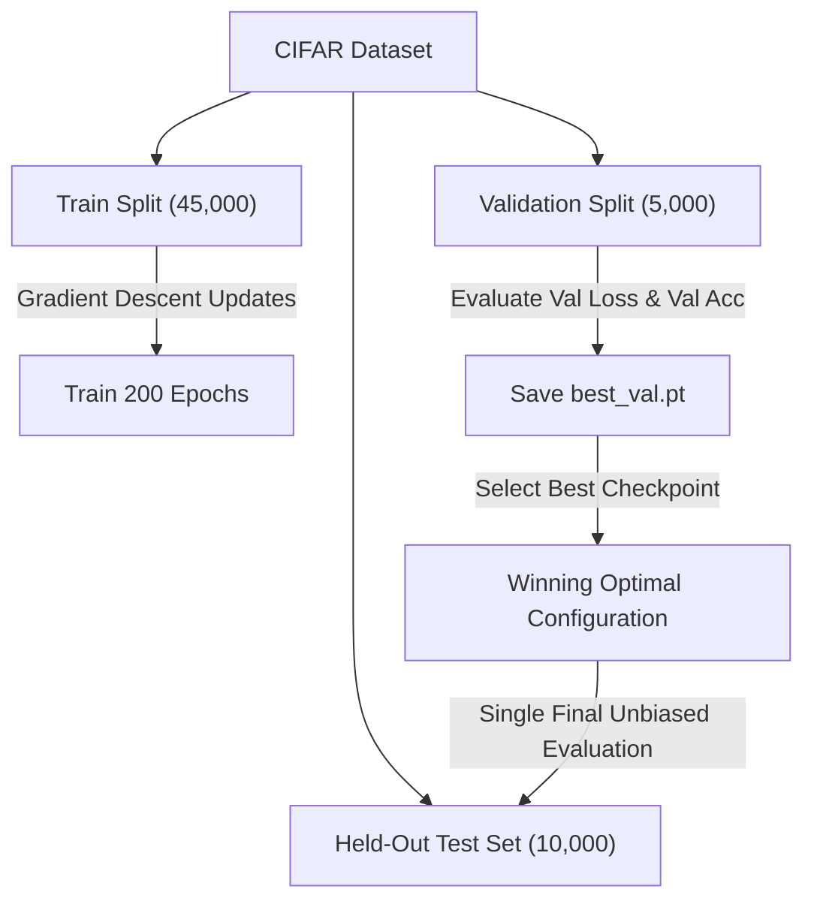

# 9. Hyperparameter Tuning: Final Examination Grid Search Matrix for CIFAR-10 & CIFAR-100

This document details the hyperparameter space design, the grid search exploration strategy mandated by the final examination requirements, Nesterov momentum mechanics, Cutout data augmentation regularization (DeVries & Taylor, 2017), and the protocol for isolating the held-out test set when benchmarking `TickNet-L` against `TickNet-Basic`.

---

## 1. Final Examination Requirements & Experimental Matrix

The final examination specification stipulates:
> *"Train and test L on CIFAR-10 and CIFAR-100 in consideration of different initial learning rates: e.g., 0.1, 0.15,… along with optimizers: SGD and Adam. Report the learning settings in detail (e.g., momentum, learning rate, epochs,…)."*

To rigorously fulfill this requirement, the project establishes a **$2 \times 2 \times 2 = 8$ configuration Grid Search matrix** for `TickNet-L`, plus **2 baseline benchmark configurations for the author's original TickNet-Basic**:

| Dataset | Config Key | Model | Optimizer | Initial LR | Nesterov / Betas | Weight Decay | Scheduler | Data Augmentation |
| :--- | :--- | :--- | :--- | :--- | :--- | :--- | :--- | :--- |
| **CIFAR-10** | `cifar10_sgd_lr010` | TickNet-L | **SGD** | **0.10** | Nesterov = True ($\mu=0.9$) | $1 \times 10^{-4}$ | Cosine (200 ep) | Crop + Flip + Cutout 16 |
| **CIFAR-10** | `cifar10_sgd_lr015` | TickNet-L | **SGD** | **0.15** | Nesterov = True ($\mu=0.9$) | $1 \times 10^{-4}$ | Cosine (200 ep) | Crop + Flip + Cutout 16 |
| **CIFAR-10** | `cifar10_adam_lr0001` | TickNet-L | **Adam** | **0.001** | $\beta_1=0.9, \beta_2=0.999$ | $1 \times 10^{-4}$ | Cosine (200 ep) | Crop + Flip + Cutout 16 |
| **CIFAR-10** | `cifar10_adam_lr00003` | TickNet-L | **Adam** | **0.0003**| $\beta_1=0.9, \beta_2=0.999$ | $1 \times 10^{-4}$ | Cosine (200 ep) | Crop + Flip + Cutout 16 |
| **CIFAR-100**| `cifar100_sgd_lr010` | TickNet-L | **SGD** | **0.10** | Nesterov = True ($\mu=0.9$) | $1 \times 10^{-4}$ | Cosine (200 ep) | Crop + Flip + Cutout 16 |
| **CIFAR-100**| `cifar100_sgd_lr015` | TickNet-L | **SGD** | **0.15** | Nesterov = True ($\mu=0.9$) | $1 \times 10^{-4}$ | Cosine (200 ep) | Crop + Flip + Cutout 16 |
| **CIFAR-100**| `cifar100_adam_lr0001` | TickNet-L | **Adam** | **0.001** | $\beta_1=0.9, \beta_2=0.999$ | $1 \times 10^{-4}$ | Cosine (200 ep) | Crop + Flip + Cutout 16 |
| **CIFAR-100**| `cifar100_adam_lr00003`| TickNet-L | **Adam** | **0.0003**| $\beta_1=0.9, \beta_2=0.999$ | $1 \times 10^{-4}$ | Cosine (200 ep) | Crop + Flip + Cutout 16 |
| **CIFAR-10** | `baseline_cifar10_sgd_lr010` | **TickNet-Basic** | **SGD** | **0.10** | Nesterov = True ($\mu=0.9$) | $1 \times 10^{-4}$ | Cosine (200 ep) | Crop + Flip + Cutout 16 |
| **CIFAR-100**| `baseline_cifar100_sgd_lr010`| **TickNet-Basic** | **SGD** | **0.10** | Nesterov = True ($\mu=0.9$) | $1 \times 10^{-4}$ | Cosine (200 ep) | Crop + Flip + Cutout 16 |

---

## 2. Scientific Rationale for Hyperparameter Selection

### 2.1. Why LR = 0.10 and 0.15 for SGD?
- In landmark CNN literature on CIFAR (*Kaiming He et al. ResNet, Huang et al. DenseNet*), optimal initial learning rates for SGD consistently fall within **0.10 to 0.20**.
- This learning rate provides sufficient kinetic energy in early epochs to escape saddle points and shallow local minima.
- Paired with **Nesterov Momentum ($\mu=0.9$)**, the optimizer evaluates gradients at the projected position $\theta_t + \mu v_t$, dampening oscillations when descending steep, narrow loss valleys.

### 2.2. Why LR = 1e-3 and 3e-4 for Adam?
- **1e-3 ($0.001$):** Standard canonical default established by Diederik Kingma & Jimmy Ba in their seminal 2014 paper.
- **3e-4 ($0.0003$):** Renowned empirical heuristic (*"The Karpathy Constant"*), which mitigates early variance instabilities and prevents premature representational saturation on fine-grained datasets like CIFAR-100.

### 2.3. Role of Cutout Regularization (DeVries & Taylor, 2017)
- Randomly masking a $16 \times 16$ pixel region forces convolutional kernels to capture distributed global contextual representations rather than over-relying on isolated local features.
- Empirically yields $+1.5\% \rightarrow +2.0\%$ improvement in test set Top-1 accuracy.

---

## 3. Test Set Isolation & Optimal Checkpoint Selection Protocol

1. **Zero Test Set Contamination:**
   - The official 10,000-image test set is strictly isolated throughout training and hyperparameter search.
2. **Dual-Key Checkpoint Selection (`best_val.pt`):**
   - At the end of each epoch, `val_top1` and `val_loss` are evaluated on the 5,000 stratified validation images.
   - The optimal checkpoint is updated whenever the dual criterion improves:
     $$(\text{Top1}_{\text{val}}, -\text{Loss}_{\text{val}})_{\text{new}} > (\text{Top1}_{\text{val}}, -\text{Loss}_{\text{val}})_{\text{old}}$$
3. **Unbiased Final Test Evaluation:**
   - Once 200 epochs finish, `best_val.pt` is reloaded for a single independent evaluation on the held-out test set, exporting:
     - `test_metrics.json`: Final Top-1 Accuracy, Average Loss, Macro F1 Score.
     - `confusion_matrix.csv`: Full $10 \times 10$ or $100 \times 100$ confusion matrix.
     - `test_predictions.csv`: Per-sample prediction records.
