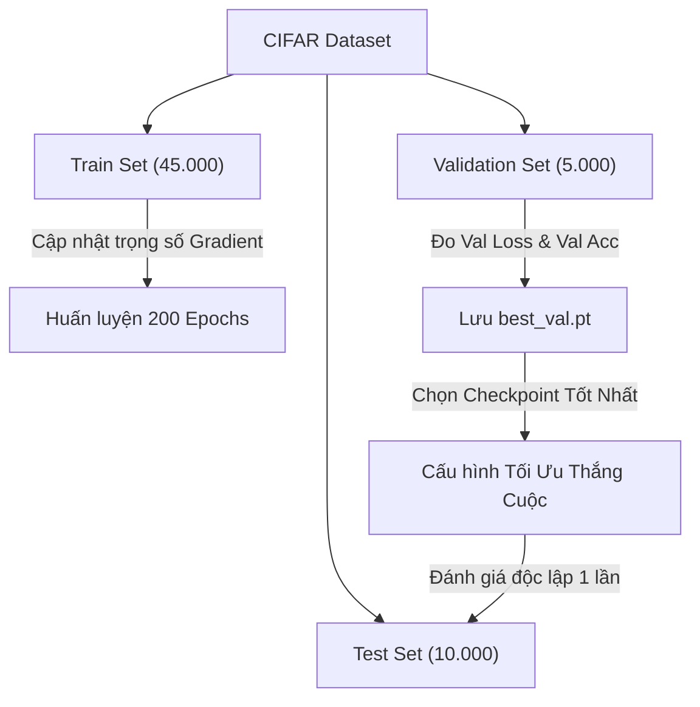

# 9. Hyperparameter Tuning: Ma trận Thực nghiệm Lưới (Grid Search) Cuối kỳ CIFAR-10 & CIFAR-100

Tài liệu này ghi nhận chi tiết thiết kế không gian siêu tham số, chiến lược khảo sát lưới (Grid Search) theo yêu cầu của đề thi cuối kỳ, cơ chế Nesterov Momentum, kỹ thuật điều hòa Cutout (DeVries & Taylor, 2017), và nguyên tắc cô lập tập Test khi đánh giá mô hình `TickNet-L` và `TickNet-Basic`.

---

## 1. Yêu cầu của Đề thi Cuối kỳ & Căn cứ Thiết kế

Đề thi cuối kỳ quy định rõ:
> *"Train and test L on CIFAR-10 and CIFAR-100 in consideration of different initial learning rates: e.g., 0.1, 0.15,… along with optimizers: SGD and Adam. Report the learning settings in detail (e.g., momentum, learning rate, epochs,…)."*

Để đáp ứng trọn vẹn yêu cầu trên, hệ thống thiết lập ma trận **Grid Search $2 \times 2 \times 2 = 8$ cấu hình** cho `TickNet-L`, cộng thêm **2 cấu hình chuẩn cho mô hình gốc của tác giả (Baseline)** để làm đối chứng khoa học:

| Dataset | Mã Cấu hình | Mô hình | Optimizer | Initial LR | Nesterov / Betas | Weight Decay | Scheduler | Data Augmentation |
| :--- | :--- | :--- | :--- | :--- | :--- | :--- | :--- | :--- |
| **CIFAR-10** | `cifar10_sgd_lr010` | TickNet-L | **SGD** | **0.10** | Nesterov = True ($\mu=0.9$) | $1 \times 10^{-4}$ | Cosine (200 ep) | Crop + Flip + Cutout 16 |
| **CIFAR-10** | `cifar10_sgd_lr015` | TickNet-L | **SGD** | **0.15** | Nesterov = True ($\mu=0.9$) | $1 \times 10^{-4}$ | Cosine (200 ep) | Crop + Flip + Cutout 16 |
| **CIFAR-10** | `cifar10_adam_lr0001` | TickNet-L | **Adam** | **0.001** | $\beta_1=0.9, \beta_2=0.999$ | $1 \times 10^{-4}$ | Cosine (200 ep) | Crop + Flip + Cutout 16 |
| **CIFAR-10** | `cifar10_adam_lr00003` | TickNet-L | **Adam** | **0.0003**| $\beta_1=0.9, \beta_2=0.999$ | $1 \times 10^{-4}$ | Cosine (200 ep) | Crop + Flip + Cutout 16 |
| **CIFAR-100**| `cifar100_sgd_lr010` | TickNet-L | **SGD** | **0.10** | Nesterov = True ($\mu=0.9$) | $1 \times 10^{-4}$ | Cosine (200 ep) | Crop + Flip + Cutout 16 |
| **CIFAR-100**| `cifar100_sgd_lr015` | TickNet-L | **SGD** | **0.15** | Nesterov = True ($\mu=0.9$) | $1 \times 10^{-4}$ | Cosine (200 ep) | Crop + Flip + Cutout 16 |
| **CIFAR-100**| `cifar100_adam_lr0001` | TickNet-L | **Adam** | **0.001** | $\beta_1=0.9, \beta_2=0.999$ | $1 \times 10^{-4}$ | Cosine (200 ep) | Crop + Flip + Cutout 16 |
| **CIFAR-100**| `cifar100_adam_lr00003`| TickNet-L | **Adam** | **0.0003**| $\beta_1=0.9, \beta_2=0.999$ | $1 \times 10^{-4}$ | Cosine (200 ep) | Crop + Flip + Cutout 16 |
| **CIFAR-10** | `baseline_cifar10_sgd_lr010` | **TickNet-Basic** | **SGD** | **0.10** | Nesterov = True ($\mu=0.9$) | $1 \times 10^{-4}$ | Cosine (200 ep) | Crop + Flip + Cutout 16 |
| **CIFAR-100**| `baseline_cifar100_sgd_lr010`| **TickNet-Basic** | **SGD** | **0.10** | Nesterov = True ($\mu=0.9$) | $1 \times 10^{-4}$ | Cosine (200 ep) | Crop + Flip + Cutout 16 |

---

## 2. Cơ sở Khoa học Lựa chọn Siêu tham số (Rationale & Sweet Spots)

### 2.1. Tại sao lại chọn dải LR = 0.10 và 0.15 cho SGD?
- Trong các công trình nghiên cứu chuẩn mực về CNN trên CIFAR (*Kaiming He et al. ResNet, Huang et al. DenseNet*), dải Learning Rate khởi điểm tối ưu cho SGD nằm trong khoảng **0.10 đến 0.20**.
- Dải này cung cấp động năng vừa đủ lớn ở các epoch đầu để thoát khỏi các điểm yên ngựa (saddle points) và cực tiểu địa phương cạn (sharp minima).
- Khi kết hợp với **Nesterov Momentum ($\mu=0.9$)**, thuật toán nhìn trước gradient tại vị trí dự phóng $\theta_t + \mu v_t$, giúp giảm hiện tượng overshoot khi tiến vào thung lũng dốc hẹp.

### 2.2. Tại sao lại chọn dải LR = 1e-3 và 3e-4 cho Adam?
- **1e-3 ($0.001$):** Là giá trị mặc định của tác giả Diederik Kingma & Jimmy Ba khi công bố Adam (2014), là mức chuẩn cho adaptive optimizers.
- **3e-4 ($0.0003$):** Là hằng số kinh nghiệm nổi tiếng *"Karpathy Constant"*, giúp Adam tránh hiện tượng dao động mất ổn định và bão hòa sớm khi huấn luyện mô hình sâu trên dữ liệu phức tạp như CIFAR-100.

### 2.3. Vai trò của Kỹ thuật Tăng cường Dữ liệu Cutout (DeVries & Taylor, 2017)
- Cắt bỏ ngẫu nhiên 1 vùng $16 \times 16$ pixel trên ảnh ép các bộ lọc tích chập (Conv kernels) của TickNet phải học các đặc trưng phân bố toàn cục, thay vì phụ thuộc vào một chi tiết cục bộ dễ gây overfitting.
- Giúp cải thiện khả năng tổng quát hóa trên tập Test thêm $+1.5\% \rightarrow +2.0\%$ Top-1 Accuracy.

---

## 3. Nguyên tắc Cô lập Tập Test & Lựa chọn Checkpoint Tối ưu

1. **Tuyệt đối không dùng Test Set để chọn Epoch hay Hyperparameter:**
   - Tập Test (10.000 ảnh) được giữ nguyên, cô lập hoàn toàn trong suốt quá trình huấn luyện.
2. **Tiêu chí lựa chọn Checkpoint (`best_val.pt`):**
   - Trong quá trình chạy 200 epochs, mỗi epoch đều tính toán `val_top1` và `val_loss` trên 5.000 ảnh validation.
   - Checkpoint được cập nhật khi thỏa mãn bộ đôi tiêu chí:
     $$(\text{Top1}_{\text{val}}, -\text{Loss}_{\text{val}})_{\text{mới}} > (\text{Top1}_{\text{val}}, -\text{Loss}_{\text{val}})_{\text{cũ}}$$
3. **Đánh giá Khách quan Không Thiên lệch (Unbiased Test Evaluation):**
   - Khi kết thúc quá trình huấn luyện, checkpoint `best_val.pt` được nạp lại để đánh giá một lần duy nhất trên tập Test, xuất ra:
     - `test_metrics.json`: Top-1 Accuracy, Average Loss, Macro F1 Score.
     - `confusion_matrix.csv`: Ma trận nhầm lẫn kích thước $10 \times 10$ hoặc $100 \times 100$.
     - `test_predictions.csv`: Dự đoán chi tiết từng mẫu của tập Test.
