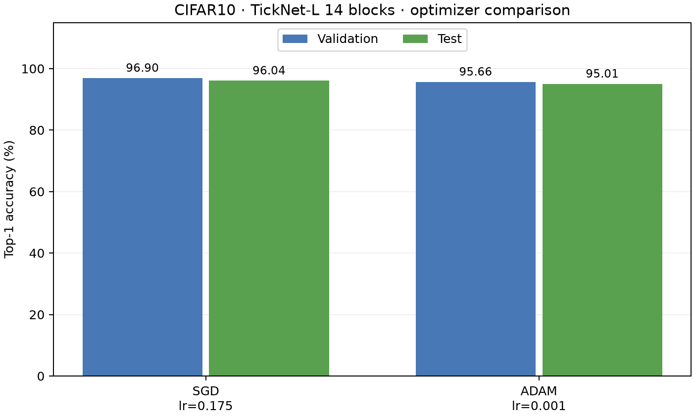
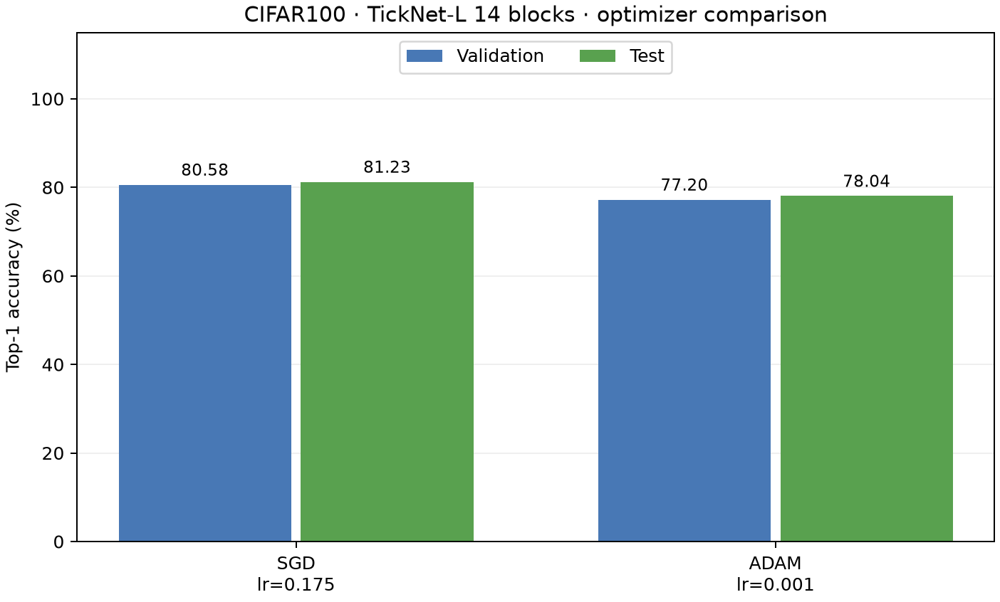
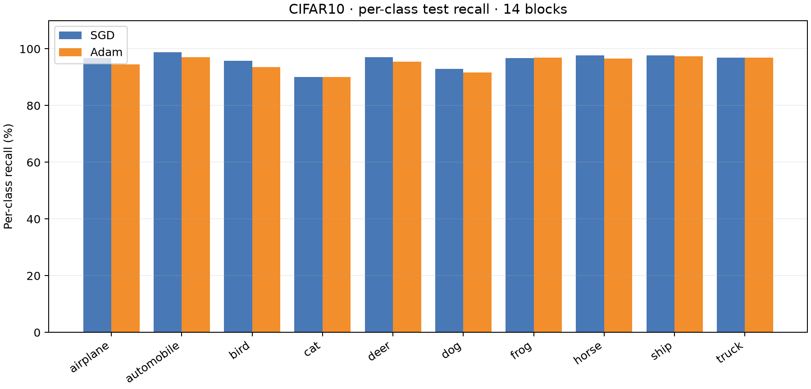
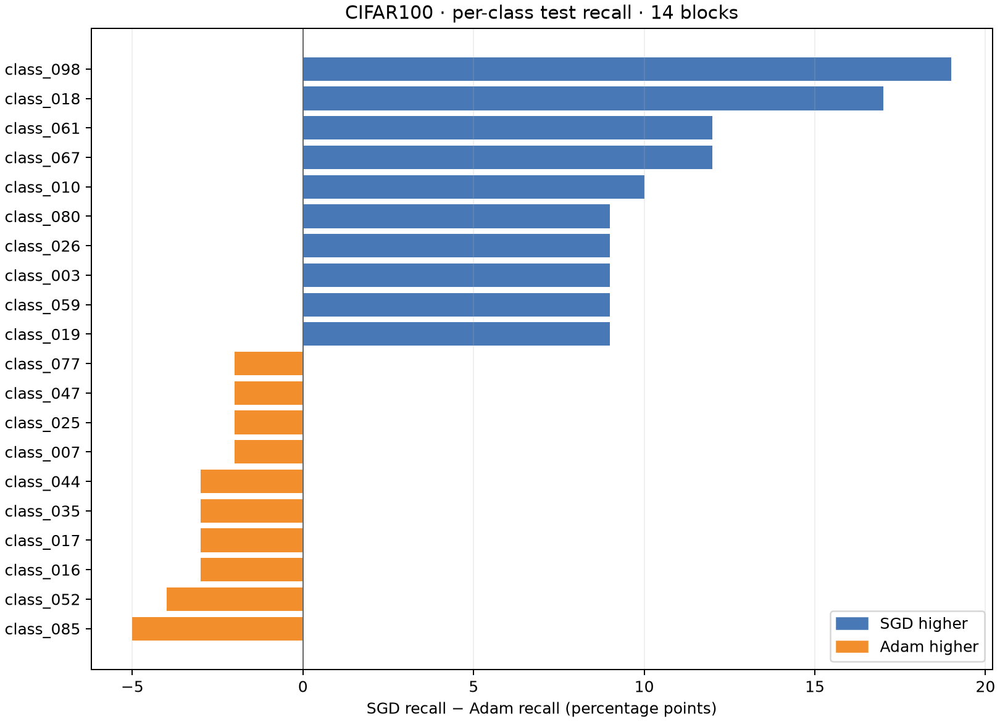

# Kết quả final — TickNet-L Large v2 (14 khối)

Bộ báo cáo này dùng **một kiến trúc 14 khối** cho CIFAR-10 và CIFAR-100. Mỗi dataset được train riêng bằng SGD và Adam, thành bốn checkpoint. Số liệu đến từ bốn run Kaggle đã hoàn tất trong [runs](../../runs/); bước tạo báo cáo không train lại mô hình. Các figure và CSV của TickNet-L 7 khối cũ đã được thay khỏi [report_assets](report_assets/).

## Kết quả bốn run

| Dataset | Optimizer | LR | Weight decay | Best val epoch | Val Top-1 (%) | Test Top-1 (%) | Test loss | Macro F1 |
| --- | --- | ---: | ---: | ---: | ---: | ---: | ---: | ---: |
| CIFAR-10 | **SGD** | 0.175 | 0.0001 | 187 | **96.90** | **96.04** | 0.172538 | 0.960355 |
| CIFAR-10 | Adam | 0.001 | 0.0001 | 199 | 95.66 | 95.01 | 0.202167 | 0.950145 |
| CIFAR-100 | **SGD** | 0.175 | 0.0005 | 198 | **80.58** | **81.23** | 0.700414 | 0.812142 |
| CIFAR-100 | Adam | 0.001 | 0.0005 | 200 | 77.20 | 78.04 | 0.827812 | 0.780109 |

SGD dẫn đầu **validation** trên cả hai dataset, nên checkpoint SGD được chọn cho mỗi dataset. Test chỉ dùng để báo cáo kết quả sau lựa chọn; không dùng để chọn epoch hay optimizer. Đường dẫn và SHA-256 của hai checkpoint được chọn ở [selected_checkpoints.json](selected_checkpoints.json).

## Phân tích

- **CIFAR-10:** SGD cao hơn Adam 1,24 điểm phần trăm trên validation và 1,03 điểm trên test. Trong confusion matrix của SGD, hai lỗi nổi bật là ảnh *cat* bị đoán *dog* 53 lần và ảnh *dog* bị đoán *cat* 46 lần; recall của *cat* là 90,0%, thấp nhất trong 10 lớp. Chi tiết từng lớp nằm ở [cifar10_per_class_comparison.csv](report_assets/cifar10_per_class_comparison.csv).
- **CIFAR-100:** SGD cao hơn Adam 3,38 điểm phần trăm trên validation và 3,19 điểm trên test, đạt mục tiêu **Test Top-1 ≥80%**. SGD vượt Adam nhiều nhất về recall ở class_098 (+19 điểm), class_018 (+17 điểm); Adam vẫn hơn ở một số lớp, ví dụ class_085 (+5 điểm so với SGD). Các lớp khó nhất của SGD gồm class_046 (56% recall), class_035 (57%) và class_072 (58%). Dataset có 100 ảnh test mỗi lớp, nên 1 ảnh tương ứng 1 điểm phần trăm recall. Xem [cifar100_per_class_comparison.csv](report_assets/cifar100_per_class_comparison.csv).
- Hai run SGD và Adam trong cùng dataset dùng cùng kiến trúc, split, seed, augmentation, batch size, weight decay và 200 epochs. **Learning rate khác nhau** (0.175 so với 0.001), nên kết quả so sánh hai *cấu hình train* đã chạy, không tách riêng tác động nhân quả của optimizer. Mỗi cấu hình mới có một seed; chưa có độ lệch chuẩn qua nhiều lần train.

## Kiến trúc và cách train

- TickNet-L Large v2 có độ sâu theo stage (1, 2, 5, 5, 1), tổng **14 khối**. CIFAR-10: **4.453.650 tham số**, **0,788601088 GFLOPs**; CIFAR-100: **4.545.900 tham số**, **0,788785408 GFLOPs**. Cả hai nằm dưới giới hạn 6 triệu tham số và 1 GFLOP của đề bài.
- FLOPs tính trên một lần forward, batch 1, theo quy ước **1 MAC = 2 FLOPs**, chỉ tính Conv2d và Linear. Phép BN, activation, pooling, cộng residual, nhân SE, bias và di chuyển dữ liệu không nằm trong số này. Chi tiết ở [model_profiles_final.json](report_assets/model_profiles_final.json).
- Mỗi dataset: 50.000 ảnh train gốc được chia phân tầng thành 45.000 train và 5.000 validation; test chính thức gồm 10.000 ảnh. Seed 42, batch size 128, 200 epochs, cosine learning rate giảm đến 0. SGD dùng momentum 0.9 và Nesterov; Adam dùng β₁=0.9, β₂=0.999, ε=1e-8.
- CIFAR-10 dùng random crop, horizontal flip và Cutout độ dài 16; CIFAR-100 dùng RandAugment (2 phép, magnitude 7) và CutMix (α=1, xác suất 0,5). Validation và test không dùng augmentation train.
- Epoch tốt nhất được chọn bằng validation Top-1; nếu hòa, chọn validation loss thấp hơn. SGD và Adam trên cùng dataset dùng cùng split theo SHA-256 ghi trong config.json. Thông tin runtime trong config là GPU Tesla T4.

## Figure, CSV và bằng chứng

[report_assets](report_assets/) có **31 file** dành riêng cho bốn run 14 khối:

- Mỗi run có ảnh learning curves, CSV 200 epochs, confusion matrix dạng ảnh và CSV, cùng classification report theo lớp. Ma trận CIFAR-10 thể hiện số ảnh; ma trận CIFAR-100 thể hiện tỷ lệ theo hàng trên hình, còn CSV luôn là số ảnh gốc.
- Mỗi dataset có bảng so sánh SGD/Adam, hình so sánh optimizer, bảng per-class và hình so sánh recall theo lớp.
- [final_required_summary.csv](report_assets/final_required_summary.csv), [class_mapping.csv](report_assets/class_mapping.csv) và [model_profiles_final.json](report_assets/model_profiles_final.json) là ba file chung. [large_v2_14block_summary.csv](large_v2_14block_summary.csv) ở thư mục này là bảng tổng hợp cùng số liệu đầy đủ.

CIFAR-100 dùng nhãn số class_000 đến class_099, vì output được lưu không có bảng tên fine label. Không suy đoán tên lớp. Bốn notebook đã chạy cùng log được giữ trong [notebooks](notebooks/). Bốn thư mục run hoàn chỉnh nằm tại [runs](../../runs/); [checkpoints_experiment](checkpoints_experiment/) hiện chỉ có một bản sao run CIFAR-100 SGD và bản sao đó khớp từng file với runs. [archive_manifest.json](archive_manifest.json) chứa SHA-256 của 36 file gốc trong bốn run.

## Mức độ xác thực và tái tạo

Script đã kiểm tra checksum các output, đủ 200 epoch, checkpoint tốt nhất theo validation, kiến trúc và tensor của best_val.pt khớp trạng thái tốt nhất lưu trong last.pt. Nó cũng đối chiếu **10.000 dự đoán test mỗi run**, confusion matrix, Top-1, macro F1 và test loss. Checkpoint của cả bốn run load nghiêm ngặt vào mô hình 14 khối hiện tại. Đây là xác thực output và khả năng load checkpoint; **chưa chạy lại full inference** từ ảnh CIFAR-100 trong lần tạo báo cáo này vì dữ liệu ảnh CIFAR-100 không có sẵn trong workspace. Do đó, số liệu test là kết quả Kaggle đã lưu và được kiểm tra tính nhất quán, không phải một lần đánh giá độc lập mới.

Từ thư mục gốc repo, chạy lại bước xác thực và dựng báo cáo bằng:

    python scripts/build_large_v2_experiment_report.py

Script yêu cầu bốn thư mục run có đủ file trong runs; nó không huấn luyện lại. Báo cáo này không dùng kết quả của mô hình L cũ để lựa chọn checkpoint.
