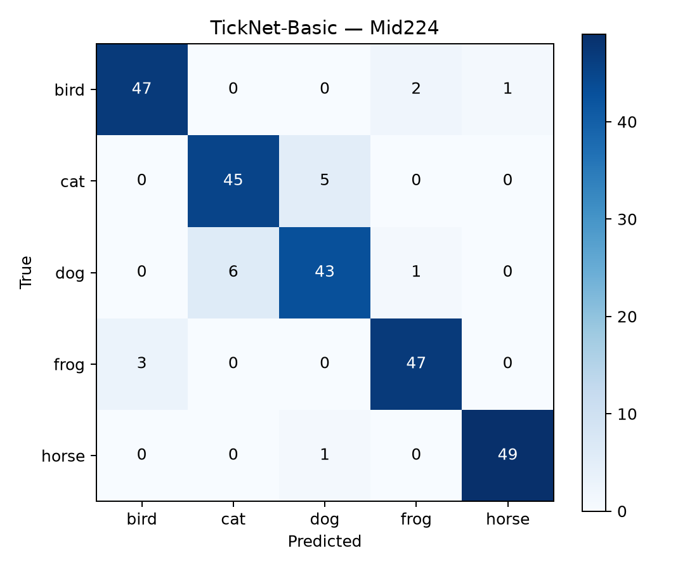
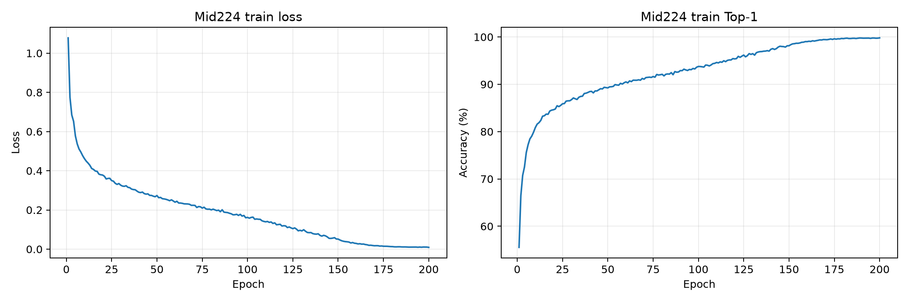
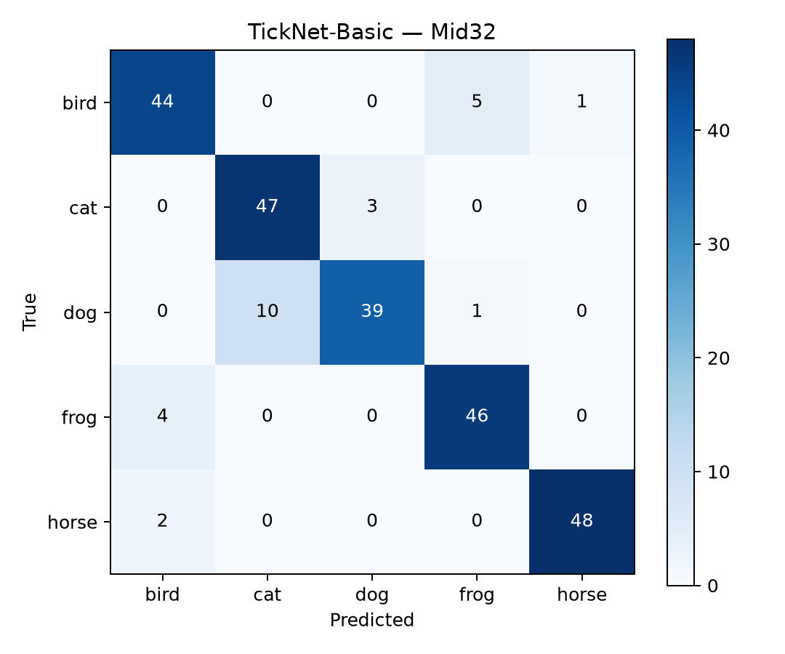
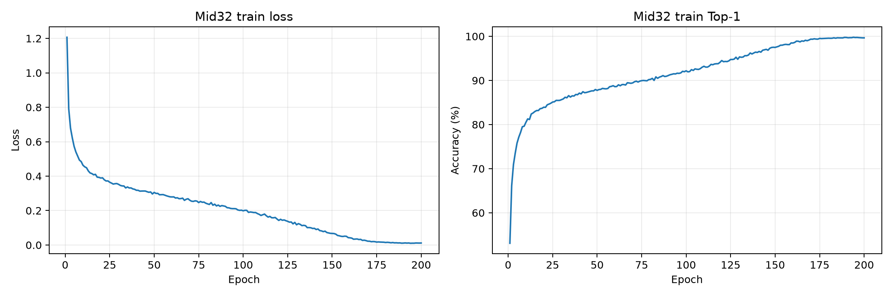

# Results Dossier & Technical Audit: TickNet-Basic (Author Baseline)

This directory consolidates experimental results, evaluation charts, checkpoint weights, architecture schematics, and verification artifacts for **TickNet-Basic** (the author's original baseline architecture), serving as the foundational **comparative benchmark** across Midterm and Final Examination projects.

---

## 1. Executive Summary & Core Metric Profile

TickNet-Basic strictly retains 100% of the author's original architecture from `models/TickNet.py`, `models/common.py`, and `models/SE_Attention.py`. The model is configured with a 5-class classification head for training and evaluation on both **Mid32** ($32 \times 32$) and **Mid224** ($224 \times 224$) datasets.

| Metric | **TickNet-Basic (Author Baseline)** | TickNet-C | TickNet-L v1 | Final Exam Budget Ceiling |
| :--- | :---: | :---: | :---: | :---: |
| **Learnable Parameters** | **1,062,223 (~1.06M)** | 5,155,467 | 1,096,260 | $\le$ **6,000,000 (6M)** |
| **GFLOPs Mid32 (32×32)** | **0.158428 G** | 0.256830 G | 0.157821 G | **< 1.0 G** |
| **GFLOPs Mid224 (224×224)** | **0.988343 G** *(near 1G budget)* | 0.821054 G | 0.796760 G | **< 1.0 G** |
| **Top-1 Accuracy Mid32** | **89.6% (224/250)** | 91.2% (228/250) | 91.6% (229/250) | Benchmark Evaluation |
| **Macro F1 Mid32** | **0.8956** | 0.9117 | 0.9158 | Classification Metric |
| **Top-1 Accuracy Mid224** | **92.4% (231/250)** | 94.4% (236/250) | 95.6% (239/250) | Benchmark Evaluation |
| **Macro F1 Mid224** | **0.9240** | 0.9439 | 0.9559 | Classification Metric |

*FLOPs measurement convention: 1 MAC = 2 FLOPs, batch size 1, eval mode, Conv2d and Linear layers only.*

---

## 2. Directory Structure of `Model_Basic`

```text
Model_Basic/
├── README.md                                          # Master Technical Dossier (this file)
├── TickNet_Model_Baseline_Basic_Architecture.drawio   # Visual architecture schematic (Draw.io)
│
├── report_assets/                                     # Evaluation plots and assets for technical reporting
│   ├── mid32_learning_curves.png                      # Mid32 learning curves (Loss & Top-1 over 200 epochs)
│   ├── mid32_confusion_matrix.png                     # 5-class confusion matrix heatmap (Mid32)
│   ├── mid32_confusion_matrix.csv                     # Raw confusion matrix counts (Mid32)
│   ├── mid32_classification_report.csv                # Per-class Precision, Recall, and F1 (Mid32)
│   ├── mid224_learning_curves.png                     # Mid224 learning curves (Loss & Top-1 over 200 epochs)
│   ├── mid224_confusion_matrix.png                    # 5-class confusion matrix heatmap (Mid224)
│   ├── mid224_confusion_matrix.csv                    # Raw confusion matrix counts (Mid224)
│   ├── mid224_classification_report.csv               # Per-class Precision, Recall, and F1 (Mid224)
│   ├── dataset_properties_by_class.csv                # Class distribution across train and test splits
│   ├── midterm_required_summary.csv                   # Summary table aligned with exam requirements
│   └── model_profiles_basic.json                      # Layer-by-layer parameter & FLOPs profile for Basic
│
├── comparisons/                                       # Cross-model comparison plots: Basic vs C and L
│   ├── accuracy_by_dataset.png                        # Top-1 Accuracy comparison across 3 models
│   ├── macro_f1_by_dataset.png                        # Macro F1 comparison across 3 models
│   ├── accuracy_vs_compute_mid224.png                 # Scatter plot of Accuracy vs GFLOPs on Mid224
│   ├── reported_metrics.csv                           # Raw unrounded metric master table
│   └── split_provenance.csv                           # Data split hash and provenance audit
│
├── training_logs/                                     # 200-epoch training logs & genuine checkpoints
│   ├── mid32/
│   │   ├── config.json                                # Training config (Seed 42, Batch 64, SGD, lr 0.1)
│   │   ├── epochs.csv                                 # Per-epoch loss and accuracy metrics (epochs 1 to 200)
│   │   ├── test_metrics.json                          # Independent test set evaluation metrics
│   │   └── last.pt                                    # Final checkpoint weights (Epoch 200, 8.3MB)
│   └── mid224/
│       ├── config.json                                # Training config (Seed 42, Batch 64, SGD, lr 0.1)
│       ├── epochs.csv                                 # Per-epoch loss and accuracy metrics (epochs 1 to 200)
│       ├── test_metrics.json                          # Independent test set evaluation metrics
│       └── last.pt                                    # Final checkpoint weights (Epoch 200, 8.3MB)
│
└── verification_and_predictions/                      # Independent audit records & sample predictions
    ├── basic_mid32_predictions.csv                    # Per-sample predictions on Mid32 test set (250 images)
    ├── basic_mid224_predictions.csv                   # Per-sample predictions on Mid224 test set (250 images)
    ├── verification.json                              # Independent forensic audit certificate (2026-10-01)
    └── source_checks.json                             # Git commit hash and unit test consistency checks
```

---

## 3. TickNet-Basic Architecture Analysis & Computational Bottleneck

### 3.1. Original FR-PDP Block Processing Flow
Each FR-PDP block in TickNet-Basic follows this sequential pipeline:
```text
x ───► PW1 1×1 (Cin → Cin, Linear)
       │
       ▼
      DW 3×3 (Fixed kernel size, respective stride) + BN + ReLU
       │
       ▼
      PW2 1×1 (Cin → Cout) + BN + ReLU
       │
       ▼
      Squeeze-and-Excitation (SE Attention)
       │
       ▼
      (+) ◄── Shortcut (Identity if shapes match, or PW Linear Projection)
```

- **Channel Configuration**: Stem 32 channels $\to$ Stage 1 (128) $\to$ Stage 2 (64) $\to$ Stage 3 (128) $\to$ Stage 4 (256) $\to$ Stage 5 (512) $\to$ Head 1024 $\to$ GAP $\to$ Classifier (5 classes).
- Each stage contains exactly **1 FR-PDP block** (5 blocks total).

### 3.2. Core Computational Bottleneck
Detailed analysis in [`model_profiles_basic.json`](report_assets/model_profiles_basic.json) reveals:
- At $224 \times 224$ resolution, **Stage 2 alone consumes 0.52103 GFLOPs**, representing **52.7% of total network compute**.
- **Root Cause**: The pointwise convolution PW1 entering Stage 2 operates on high-resolution $112 \times 112$ feature maps with 128 channels before the depthwise convolution performs spatial downsampling (stride 2).
- **Consequence**: Total FLOPs for Basic at $224 \times 224$ reaches **0.988343 GFLOPs**—dangerously close to the $1.0\text{ G}$ ceiling (leaving a margin of only 1.17%). The model cannot expand depth in deeper stages without structural optimization of this stage.
- *This empirical bottleneck provided the primary technical motivation for the proposed **TickNet-L v1** architecture.*

---

## 4. Empirical Evaluation Details for TickNet-Basic

### 4.1. Results on Mid224 ($224 \times 224$)
- **Top-1 Accuracy**: **92.4%** (231/250 test images correct).
- **Macro F1**: **0.9240**.
- **Per-Class Breakdown**:
  - `horse`: Precision 96.1%, Recall 98.0%, F1 0.970 (49/50 images).
  - `frog`: Precision 97.9%, Recall 94.0%, F1 0.959 (47/50 images).
  - `bird`: Precision 90.0%, Recall 90.0%, F1 0.900 (45/50 images).
  - `cat`: Precision 89.8%, Recall 88.0%, F1 0.889 (44/50 images).
  - `dog`: Precision 88.5%, Recall 92.0%, F1 0.902 (46/50 images).




### 4.2. Results on Mid32 ($32 \times 32$)
- **Top-1 Accuracy**: **89.6%** (224/250 test images correct).
- **Macro F1**: **0.8956**.
- **Classification Characteristics**: At $32 \times 32$ resolution, the model reliably identifies `frog` (F1: 0.960) and `horse` (F1: 0.939); accuracy decreases on `bird` (88.0%), `cat` (82.0%), and `dog` (86.0%) due to fine-grained feature blurring under low resolution.




---

## 5. Training Pipeline & Kaggle Notebooks

- **Training Hyperparameters**: Seed 42, Batch size 64, Optimizer SGD (lr = 0.1, momentum = 0.9, weight decay = 1e-4), CosineAnnealingLR (200 epochs).
- **Kaggle Training Notebooks**:
  - [Basic Mid32 (Epochs 1–200)](https://www.kaggle.com/code/khngtrnnh/dl-btgk-modelbaseline-mid32)
  - [Basic Mid224 (Epochs 1–100)](https://www.kaggle.com/code/khngtrnnh/dl-btgk-modelbasic-mid224-epoch001-100-notebook)
  - [Basic Mid224 (Epochs 101–200)](https://www.kaggle.com/code/khngtrnnh/dl-btgk-modelbasic-mid224-epoch101-200-notebook)
- **Multi-Session Resume**: Due to Kaggle's 12-hour session timeout, Mid224 was executed across two sessions (1–100 and 101–200). Session 2 restored the full model weights, optimizer, scheduler, and RNG state from epoch 100 to continue the 200-epoch cosine annealing cycle.

---

## 6. Independent Verification & Integrity Audit

According to the audit report [`verification.json`](verification_and_predictions/verification.json) dated 2026-10-01:
- Both `last.pt` checkpoints (epoch 200) for Basic loaded successfully and verified against strict SHA-256 checksums.
- Re-measuring FLOPs via `torch.utils.flop_counter.FlopCounterMode` confirmed exact agreement:
  - Basic Mid32: **0.158428 GFLOPs**.
  - Basic Mid224: **0.988343 GFLOPs**.
- Standalone inference on the local test set replicated confusion matrices and Top-1 Accuracies bit-for-bit: **89.6% (Mid32)** and **92.4% (Mid224)**.
