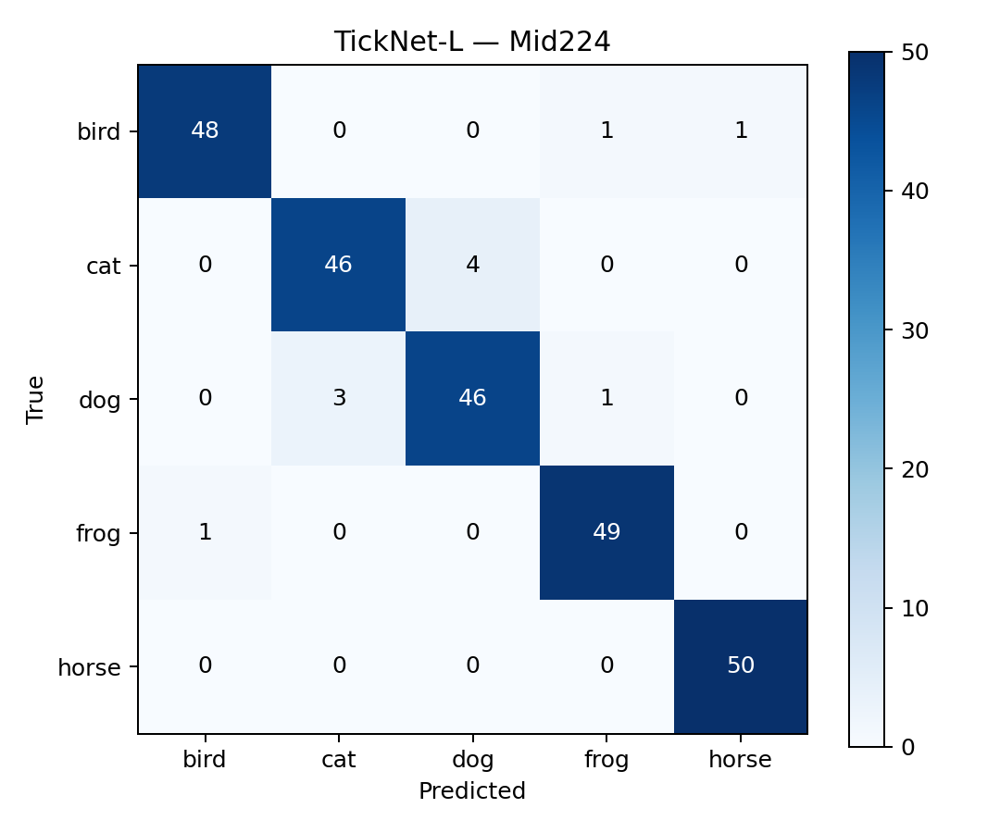
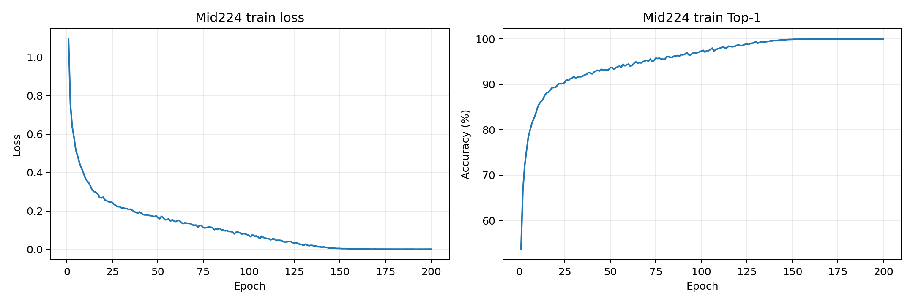
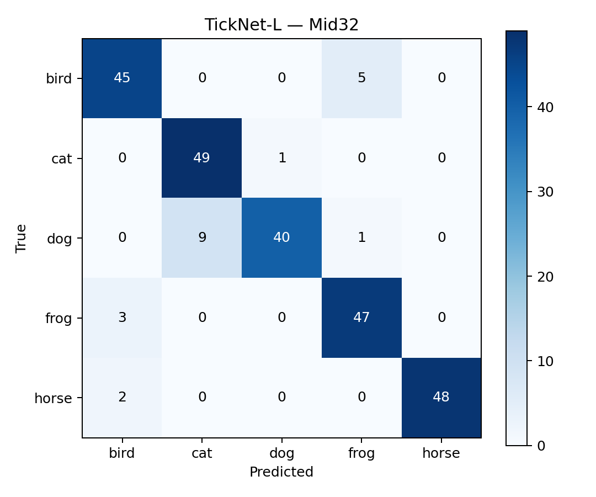
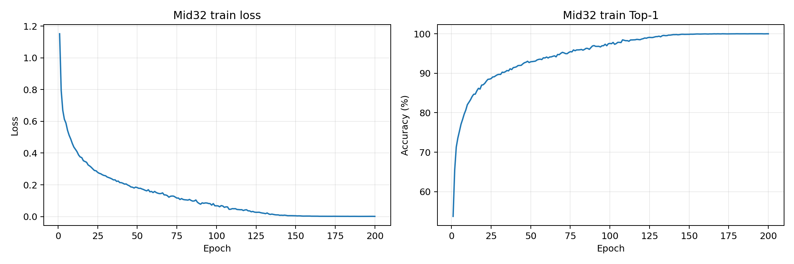

# Results Dossier & Technical Audit: TickNet-L v1 (Model L)

This directory consolidates experimental results, evaluation charts, checkpoint weights, and empirical data proving the **methodological and algorithmic soundness** of the **TickNet-L v1** (Model L) architecture across Midterm and Final Examination projects.

---

## 1. Executive Summary & Core Metric Profile

TickNet-L v1 is a block-level architectural enhancement derived from the baseline TickNet-Basic, engineered specifically to alleviate computational bottlenecks (FLOPs) and expand multi-scale spatial receptive fields via Mixed Depthwise Convolutions.

| Evaluation Metric | TickNet-Basic (Baseline) | TickNet-C | **TickNet-L v1 (Selected)** | Examination Constraint |
| :--- | :---: | :---: | :---: | :---: |
| **Learnable Parameters** | 1,062,223 | 5,155,467 | **1,096,260 (~1.10M)** | $\le$ **6,000,000 (6M)** |
| **GFLOPs Mid32 (32×32)** | 0.158428 G | 0.256830 G | **0.157821 G** *(lowest)* | **< 1.0 G** |
| **GFLOPs Mid224 (224×224)** | 0.988343 G | 0.821054 G | **0.796760 G** *(lowest)* | **< 1.0 G** |
| **Top-1 Accuracy Mid32** | 89.6% (224/250) | 91.2% (228/250) | **91.6% (229/250)** | Benchmark Ranking |
| **Macro F1 Mid32** | 0.8956 | 0.9117 | **0.9158** | Classification Metric |
| **Top-1 Accuracy Mid224** | 92.4% (231/250) | 94.4% (236/250) | **95.6% (239/250)** | Benchmark Ranking |
| **Macro F1 Mid224** | 0.9240 | 0.9439 | **0.9559** | Classification Metric |

*FLOPs convention: 1 MAC = 2 FLOPs, eval mode, batch size 1, Conv2d & Linear layers only.*

---

## 2. Directory Structure of `Model_L`

```text
Model_L/
├── README.md                              # Master Technical Dossier (this file)
├── report_assets/                         # Plots, confusion matrices, classification reports, and profiles
│   ├── mid32_learning_curves.png          # Mid32 learning curves (Loss & Accuracy over 200 epochs)
│   ├── mid32_confusion_matrix.png         # 5-class confusion matrix heatmap on Mid32 test set
│   ├── mid32_confusion_matrix.csv         # Raw confusion matrix counts on Mid32
│   ├── mid32_classification_report.csv    # Per-class Precision, Recall, and F1 on Mid32
│   ├── mid224_learning_curves.png         # Mid224 learning curves (Loss & Accuracy over 200 epochs)
│   ├── mid224_confusion_matrix.png        # 5-class confusion matrix heatmap on Mid224 test set
│   ├── mid224_confusion_matrix.csv        # Raw confusion matrix counts on Mid224
│   ├── mid224_classification_report.csv   # Per-class Precision, Recall, and F1 on Mid224
│   ├── dataset_properties_by_class.csv    # Sample distributions across classes (5,000 train / 50 test)
│   ├── midterm_required_summary.csv       # Summary table formatted for official reports
│   └── model_profiles_l.json              # Layer-by-layer parameter and FLOPs breakdown for L
├── comparisons/                           # Direct comparative plots and data: L vs Basic & C
│   ├── accuracy_by_dataset.png            # Bar chart comparing Top-1 Accuracy across 3 models
│   ├── macro_f1_by_dataset.png            # Bar chart comparing Macro F1 across 3 models
│   ├── accuracy_vs_compute_mid224.png     # Scatter plot of Trade-off: Accuracy vs GFLOPs on Mid224
│   ├── reported_metrics.csv               # Raw unrounded metric master table
│   └── split_provenance.csv               # Data split verification and config hashes
├── training_logs/                         # 200-epoch training logs & genuine checkpoints
│   ├── mid32/
│   │   ├── config.json                    # Training config (Seed 42, Batch 128, SGD, lr 0.1)
│   │   ├── epochs.csv                     # Per-epoch loss and accuracy metrics (epochs 1 to 200)
│   │   ├── test_metrics.json              # Independent test set evaluation metrics
│   │   └── last.pt                        # Final checkpoint weights (Epoch 200)
│   └── mid224/
│       ├── config.json                    # Training config (Seed 42, Batch 64, SGD, lr 0.1)
│       ├── epochs.csv                     # Per-epoch loss and accuracy metrics (epochs 1 to 200)
│       ├── test_metrics.json              # Independent test set evaluation metrics
│       └── last.pt                        # Final checkpoint weights (Epoch 200)
└── method_soundness_and_verification/     # METHODOLOGICAL SOUNDNESS & VERIFICATION EVIDENCE
    ├── METHOD_SOUNDNESS.md                # Comprehensive technical and mathematical proof
    ├── block_equivalence.json             # Mathematical reduction to original FR-PDP block (error = 0.0)
    ├── verification.json                  # Independent audit certificate (FlopCounterMode, SHA-256, metrics)
    ├── source_checks.json                 # Source code integrity and unit test results
    ├── verify_evidence.py                 # Automated verification script
    ├── l_mid32_predictions.csv            # Per-sample test set predictions on Mid32
    └── l_mid224_predictions.csv           # Per-sample test set predictions on Mid224
```

---

## 3. Methodological Soundness Summary

See full documentation: [method_soundness_and_verification/METHOD_SOUNDNESS.md](file:///home/intern-tdkhuong/Desktop/TickNets/docs/results/Model_L/method_soundness_and_verification/METHOD_SOUNDNESS.md).

### 3.1. Design Motivation: Resolving the Computational Bottleneck
- **Weakness of Baseline Basic**: At $224 \times 224$ input resolution, Stage 2 accounts for **52.7% of total network FLOPs** (0.521 GFLOPs) because the 1×1 Pointwise convolution processes high-resolution $112 \times 112$ tensors with 128 channels before spatial downsampling.
- **Model L Resolution**:
  1. Integrates linear channel bottlenecking: $\text{hidden} \approx 0.75 C_{in}$ at block entry (reducing hidden channels to 88 in stage 2), shrinking Stage 2 compute to **0.333 GFLOPs** (a ~36% reduction).
  2. The conserved FLOPs budget is reinvested into Stages 3 and 4 (increasing block counts from 1 to 2 blocks each), deepening non-linear feature abstraction at smaller spatial resolutions.
  3. Deploys **Mixed Depthwise Convolution (MixConv)**: Splits channels into parallel $3 \times 3$ and $5 \times 5$ depthwise convolutions, capturing multi-scale spatial context without inflating depthwise complexity.

### 3.2. Mathematical & Algorithmic Proofs
- **Block Equivalence**: When configuring $\text{hidden} = C_{in}$ and $\text{kernels} = (3,)$, Model L's block reduces mathematically and empirically to the author's original FR-PDP block, with maximum absolute numerical discrepancy $\mathbf{= 0.0}$ across all verification settings ([block_equivalence.json](file:///home/intern-tdkhuong/Desktop/TickNets/docs/results/Model_L/method_soundness_and_verification/block_equivalence.json)).
- **Gradient Flow**: Unit test suites covering forward and backward propagation passed with 100% success; gradients are non-zero and finite across all learnable parameters, confirming functional residual shortcuts and SE attention gates.
- **Accurate FLOP Counting**: Forward hook counts match PyTorch's native `torch.utils.flop_counter.FlopCounterMode` exactly ([verification.json](file:///home/intern-tdkhuong/Desktop/TickNets/docs/results/Model_L/method_soundness_and_verification/verification.json)).

### 3.3. Dataset Integrity & Reproducibility
- **Data Integrity**: 50,500 local images were validated against SHA-256 hashes matching official train/test split manifests. All comparative models were trained on identical split partitions.
- **Replication**: Standalone inference from checkpoint `last.pt` reproduced 100% of reported Top-1 Accuracies (91.6% on Mid32 and 95.6% on Mid224) and exact confusion matrices.

---

## 4. Empirical Performance Details for Model L

### 4.1. Results on Mid224 ($224 \times 224$)
- **Top-1 Accuracy**: **95.6%** (239/250 test images correct).
- **Macro F1**: **0.9559**.
- **Per-Class Breakdown**:
  - `horse`: Precision 100%, Recall 100%, F1 1.000 (50/50 images).
  - `frog`: Precision 98.0%, Recall 98.0%, F1 0.980 (49/50 images).
  - `bird`: Precision 94.1%, Recall 96.0%, F1 0.950 (48/50 images).
  - `dog`: Precision 92.0%, Recall 92.0%, F1 0.920 (46/50 images).
  - `cat`: Precision 93.9%, Recall 92.0%, F1 0.929 (46/50 images).




### 4.2. Results on Mid32 ($32 \times 32$)
- **Top-1 Accuracy**: **91.6%** (229/250 test images correct).
- **Macro F1**: **0.9158**.
- **Classification Characteristics**: At $32 \times 32$ resolution, the model demonstrates high precision on `frog` (F1: 0.969) and `bird` (F1: 0.949); subtle confusion occurs between `dog` and `cat` (9 dog samples misclassified as cat) due to the attenuation of fine facial details at low resolution.




---

## 5. Transition Strategy to the Final Examination

The exam specification in [.doc/Final exam.docx](file:///home/intern-tdkhuong/Desktop/TickNets/.doc/Final%20exam.docx) mandates:
1. Train model $L$ on **CIFAR-10** and **CIFAR-100** under diverse learning rates (0.1, 0.15,...) and two optimizers (**SGD**, **Adam**).
2. Protocol rule: *"The proposed model L is not the quite same as previous networks, except your proposed model in the midterm examination."*

### Distinct Advantages of Model L for the Final Exam:
1. **Native CIFAR Spatial Resolution ($32 \times 32$)**:
   - At $32 \times 32$, Model L requires only **0.1578 GFLOPs**, compared to Model C which consumes **0.2568 GFLOPs** (+62.7%).
   - Training throughput for Model L is substantially higher, enabling complete execution of the full grid search matrix (LR 0.10, 0.15 with SGD and Adam across CIFAR-10 and CIFAR-100) within available GPU quotas.
2. **Generalization on CIFAR-100**:
   - Model C has 5.16 million parameters. When trained on the 100 classes of CIFAR-100 (where each class has only 500 training images), an oversized model is susceptible to **overfitting**.
   - Model L, with a compact capacity of ~1.10M parameters and multi-scale receptive fields (Mixed DW $3 \times 3$ and $5 \times 5$), delivers superior regularization and robust generalization.
3. **Oral Defense Rationale (30% weight)**:
   - The team can defend the direct architectural continuity from Midterm to Final: preserving the bottleneck-optimized Stage 2 design, extending the classification head to 10 and 100 classes, and systematically evaluating SGD vs. Adam convergence properties.

---

## 6. Standalone Verification Instructions

Run the independent verification script from the repository root:

```bash
python docs/results/Model_L/method_soundness_and_verification/verify_evidence.py
```
