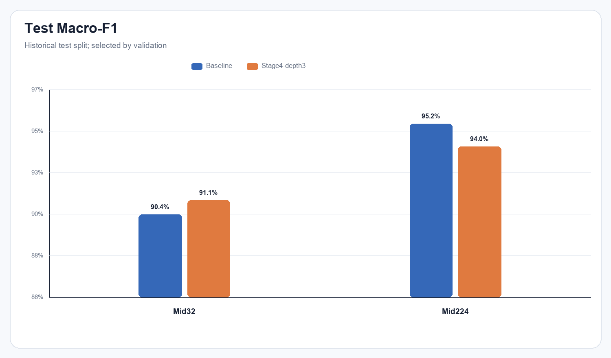
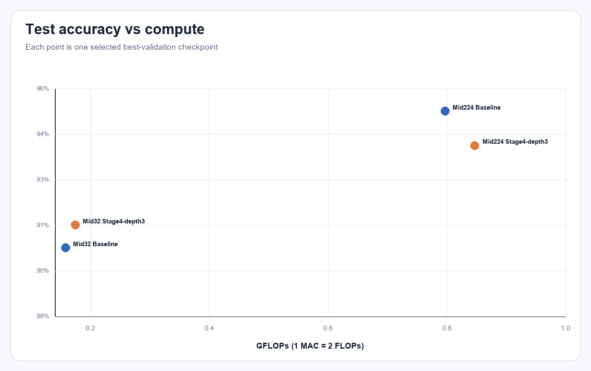
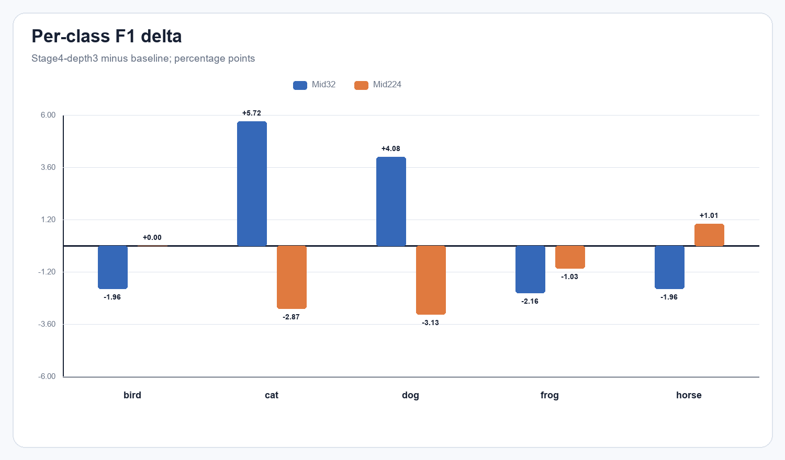
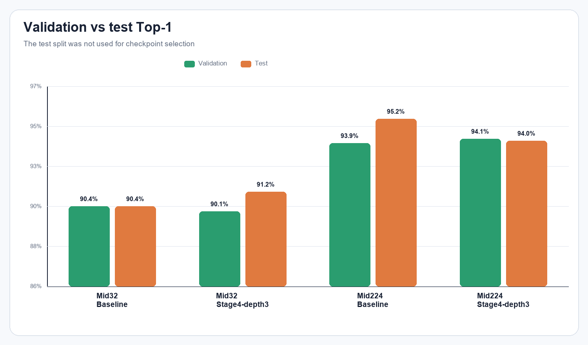

# Báo cáo thí nghiệm TickNet-L Stage4-depth3

## 1. Câu hỏi và giả thuyết

Thí nghiệm kiểm tra một thay đổi duy nhất: tăng số block Stage 4 từ 2 lên 3 bằng cách thêm `backbone.stage4.unit3`. Giả thuyết là biểu diễn sâu hơn ở Stage 4 có thể tăng chất lượng phân loại với mức tăng compute còn nằm trong giới hạn bài thi.

## 2. Thiết kế kiểm soát

Cả baseline và biến thể dùng 200 epoch, seed 42, split seed 123, batch 64, SGD (LR 0,1; momentum 0,9; weight decay 1e-4), CosineAnnealingLR và cùng augmentation. Mỗi dataset có 22.500 train, 2.500 validation và 250 test. Bốn run có cùng `membership_sha256` và `validation_sha256`; Mid32/Mid224 giữ cùng membership theo class/filename.

Checkpoint `best_val.pt` được chọn theo validation Top-1, hòa thì dùng validation loss thấp hơn. Chỉ sau khi đã có checkpoint cố định mới chạy `--evaluate`. Test không tham gia chọn epoch hay cấu hình.

Lệnh đánh giá tương ứng:

```powershell
python train_mid_experiment.py --data-root <manifest-compatible-root> --variant <Mid32|Mid224> --evaluate runs/<run>/best_val.pt --output-dir <evaluation-output>
```

## 3. Kết quả validation và historical test

| Dataset | Mô hình | Epoch | Val Top-1 | Val loss | Test Top-1 | Test loss | Macro-F1 |
| --- | --- | --- | --- | --- | --- | --- | --- |
| Mid32 | Baseline | 173 | 90.40% | 0.500445 | 90.40% | 0.405454 | 0.903817 |
| Mid32 | Stage4-depth3 | 200 | 90.12% | 0.478256 | 91.20% | 0.465283 | 0.911253 |
| Mid224 | Baseline | 177 | 93.88% | 0.276317 | 95.20% | 0.224384 | 0.951956 |
| Mid224 | Stage4-depth3 | 154 | 94.12% | 0.294577 | 94.00% | 0.205677 | 0.939903 |

Delta được tính `Stage4-depth3 - Baseline`:

| Dataset | Δ Val Top-1 (pp) | Δ Test Top-1 (pp) | Δ Macro-F1 | Δ Test loss |
| --- | --- | --- | --- | --- |
| Mid32 | -0.28 | +0.80 | +0.007436 | +0.059829 |
| Mid224 | +0.24 | -1.20 | -0.012053 | -0.018707 |




Mid32 có test Top-1 tăng từ 90,40% lên 91,20% (+0,80 điểm %), dù validation Top-1 giảm 0,28 điểm % và test loss tăng. Mid224 có validation Top-1 tăng nhẹ 0,24 điểm %, nhưng test Top-1 giảm 1,20 điểm %; test loss lại thấp hơn. Các tín hiệu trái chiều giữa dataset và giữa accuracy/loss không tạo thành bằng chứng nhất quán cho lợi ích của block mới.

## 4. Chi phí mô hình

| Thành phần | Baseline | Stage4-depth3 | Tăng |
| --- | ---: | ---: | ---: |
| Learnable parameters | 1,096,260 | 1,236,030 | +139,770 (12.75%) |
| FLOPs Mid32 | 157,820,864 | 174,236,864 | +16,416,000 (10.40%) |
| FLOPs Mid224 | 796,760,240 | 846,991,472 | +50,231,232 (6.30%) |



Cả hai kiến trúc vẫn đạt giới hạn ≤6 triệu tham số và <1 GFLOP. Tuy nhiên Stage4-depth3 trả thêm compute mà không cho lợi ích test nhất quán.

## 5. Phân tích theo lớp và quá trình học



CSV đầy đủ nằm ở `comparisons/per_class_metrics.csv`. Confusion matrix, precision/recall/F1 và learning curves của từng run nằm trong `models/<run>/`. Biểu đồ validation-vs-test giúp tránh đọc test đơn lẻ như tín hiệu chọn mô hình:



## 6. Tính toàn vẹn và khả năng kiểm tra

- Mỗi evaluation có 250 dòng dự đoán; tổng confusion matrix là 250.
- Số đúng từ predictions bằng đường chéo confusion matrix; Top-1 và Macro-F1 được tính lại và khớp JSON chính thức.
- SHA-256 checkpoint evaluation khớp `best_val.pt` được lưu trong gói kết quả.
- Lịch sử mỗi run liên tục đủ epoch 1–200.
- Tất cả source hash ghi lúc train khớp checkout hiện tại.
- Config train ghi commit `8077f26b439547e97d0e95aff5e4f38d4469b609` và `git_dirty=true`; trạng thái dirty được công khai thay vì coi commit là bằng chứng duy nhất.

Chi tiết máy-đọc được nằm trong `verification/evaluation_manifest.json`, `verification/source_checks.json` và `comparisons/checkpoint_manifest.csv`.

## 7. Kết luận và bước tiếp theo

Với dữ liệu hiện tại, **không nên thay baseline bằng Stage4-depth3 làm mặc định**. Kết quả Mid32 đáng để kiểm chứng thêm, nhưng một seed và test split lịch sử không đủ để khẳng định cải thiện tổng quát. Nếu còn ngân sách, chạy cặp seed 43 và 44 cho cả baseline/experiment, giữ split seed 123 và báo cáo mean ± std trên validation trước; chỉ mở test sau khi quy tắc chọn mô hình đã khóa. Không nên chọn seed hoặc điều chỉnh recipe dựa trên bốn kết quả test trong báo cáo này.
