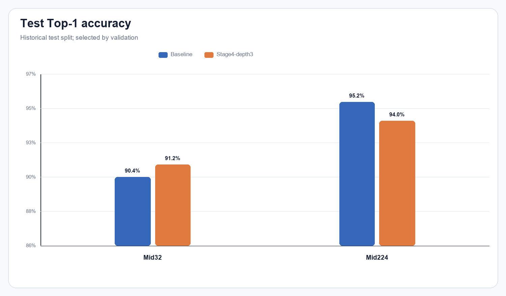

# Kết quả thí nghiệm tăng độ sâu Stage 4

Thư mục này là gói bằng chứng đầy đủ cho ablation **TickNet-L v1 baseline vs. TickNet-L Stage4-depth3** trên Mid32 và Mid224. Bốn checkpoint đều train 200 epoch với seed 42, split seed 123; checkpoint test là `best_val.pt` được chọn bằng validation, không chọn bằng test.

## Kết quả tóm tắt

| Dataset | Mô hình | Best epoch | Val Top-1 | Test Top-1 | Macro-F1 | GFLOPs |
| --- | --- | --- | --- | --- | --- | --- |
| Mid32 | Baseline | 173 | 90.40% | 90.40% | 0.9038 | 0.157821 |
| Mid32 | Stage4-depth3 | 200 | 90.12% | 91.20% | 0.9113 | 0.174237 |
| Mid224 | Baseline | 177 | 93.88% | 95.20% | 0.9520 | 0.796760 |
| Mid224 | Stage4-depth3 | 154 | 94.12% | 94.00% | 0.9399 | 0.846991 |

Kết quả chưa ủng hộ việc chọn Stage4-depth3 làm mặc định: Mid32 tăng **+0,80 điểm %** test Top-1 nhưng giảm **-0,28 điểm %** validation; Mid224 tăng **+0,24 điểm %** validation nhưng giảm **-1,20 điểm %** test Top-1. Biến thể cũng tăng 139.770 tham số và tăng FLOPs. Với chỉ một seed, đây là bằng chứng định hướng chứ chưa phải kết luận thống kê.

Đọc phân tích chi tiết tại [EXPERIMENT_REPORT.md](EXPERIMENT_REPORT.md).

## Cấu trúc bằng chứng

- `checkpoints/<run>/`: toàn bộ `best_val.pt`, `last.pt`, config, lịch sử 200 epoch và validation split gốc.
- `models/<run>/`: README riêng, metrics, 250 predictions, confusion matrix, classification report và ba biểu đồ.
- `comparisons/`: bảng tổng hợp, provenance, SHA-256 checkpoint và năm biểu đồ so sánh.
- `verification/`: audit evaluation và đối chiếu source hash.

## Lưu ý phương pháp

Split test này đã từng được quan sát trong đồ án nên được gọi là **historical test split**, không phải test độc lập mới. Không dùng kết quả test để chọn epoch, LR, seed hoặc kiến trúc. Bốn config ghi `git_dirty=true`; vì vậy báo cáo không chỉ dựa vào commit mà đối chiếu từng SHA-256 nguồn, và tất cả hash nguồn train đều khớp checkout hiện tại.
