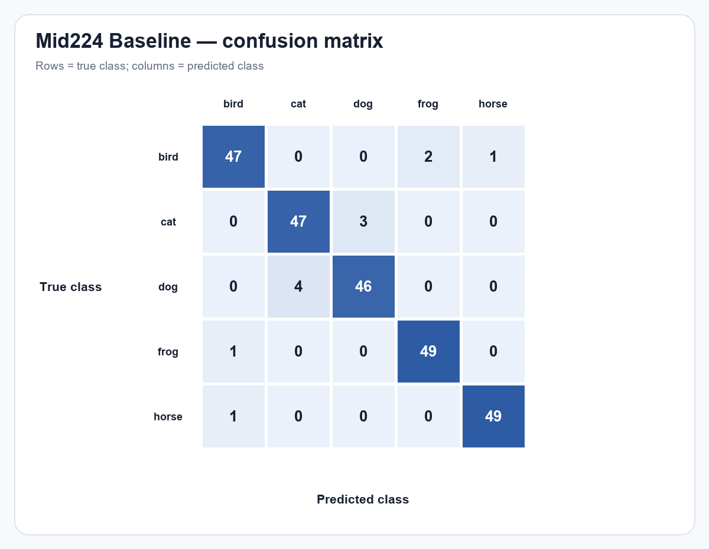
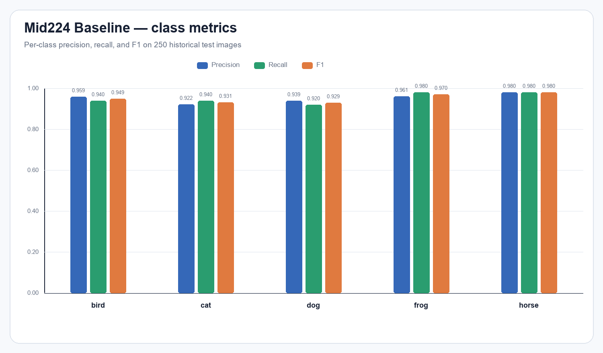
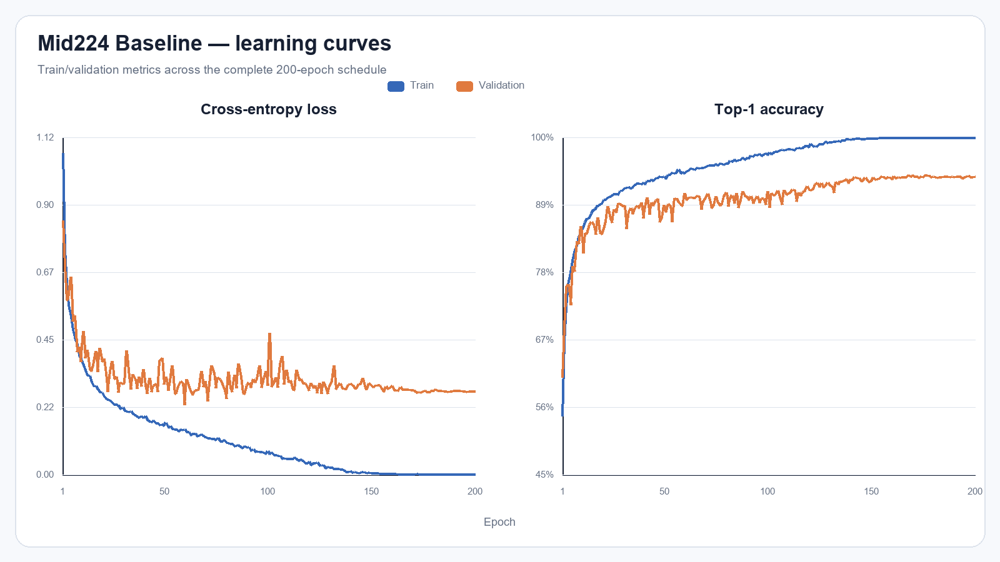

# mid224_baseline_seed42

Run này là **Baseline** trên **Mid224**, seed 42. Checkpoint đánh giá là `best_val.pt`, được chọn hoàn toàn bằng validation tại epoch **177**.

## Kết quả chính

| Chỉ số | Giá trị |
| --- | ---: |
| Validation Top-1 | 93.88% |
| Validation loss | 0.276317 |
| Test Top-1 | **95.20%** (238/250) |
| Test loss | 0.224384 |
| Test Macro-F1 | **0.951956** |
| Learnable parameters | 1,096,260 |
| FLOPs | 796,760,240 (0.796760 GFLOPs) |
| Architecture revision | `ticknet-l-v1` |

## Precision, recall và F1 theo lớp

| Lớp | Precision | Recall | F1 | Support |
| --- | --- | --- | --- | --- |
| bird | 0.9592 | 0.9400 | 0.9495 | 50 |
| cat | 0.9216 | 0.9400 | 0.9307 | 50 |
| dog | 0.9388 | 0.9200 | 0.9293 | 50 |
| frog | 0.9608 | 0.9800 | 0.9703 | 50 |
| horse | 0.9800 | 0.9800 | 0.9800 | 50 |

Các nhầm lẫn xuất hiện nhiều nhất:

- `dog` → `cat`: 4 ảnh
- `cat` → `dog`: 3 ảnh
- `bird` → `frog`: 2 ảnh

## Tệp bằng chứng

- `test_metrics.json`: kết quả do CLI evaluation chính thức sinh ra.
- `predictions.csv`: 250 dự đoán, đường dẫn đã chuẩn hóa tương đối để không phụ thuộc máy chạy.
- `confusion_matrix.csv`: ma trận có nhãn hàng/cột.
- `classification_report.csv`: precision/recall/F1/support được tính từ confusion matrix.
- Checkpoint và log huấn luyện gốc nằm tại `../../checkpoints/mid224_baseline_seed42/`.

Lưu ý: đây là split test lịch sử đã từng được quan sát trong đồ án, không phải một test set độc lập mới.
