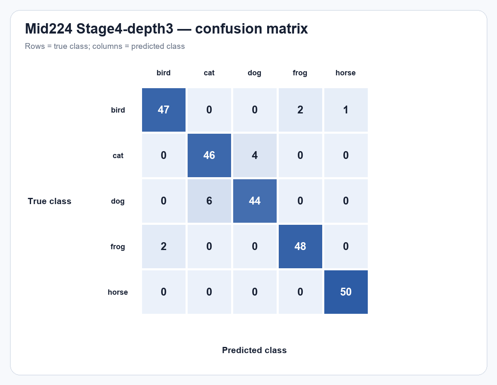
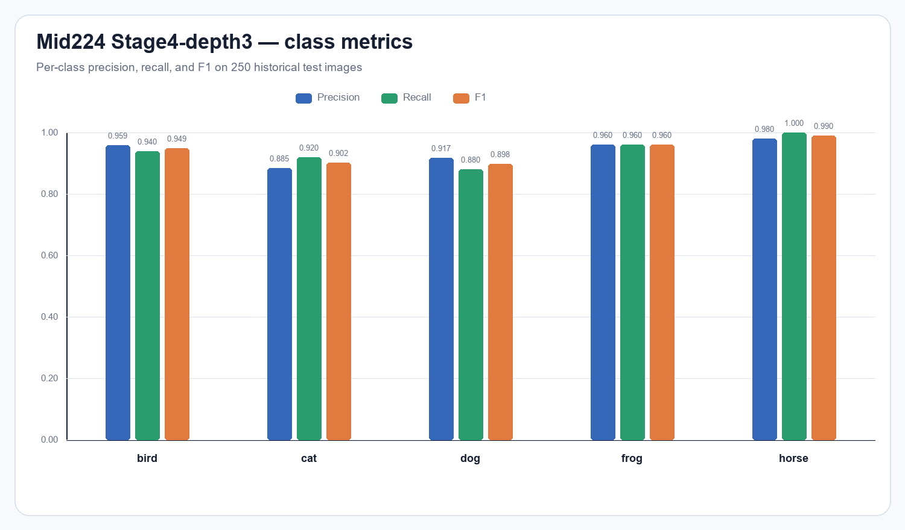
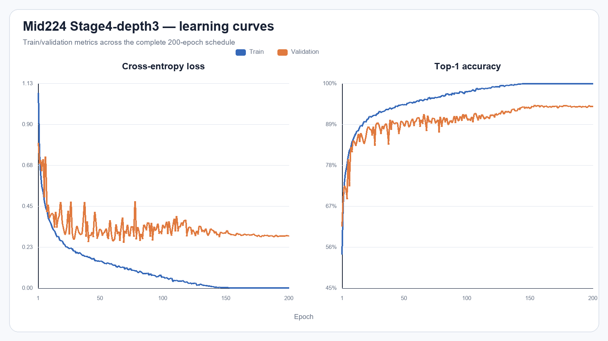

# mid224_experiment_seed42

Run này là **Stage4-depth3** trên **Mid224**, seed 42. Checkpoint đánh giá là `best_val.pt`, được chọn hoàn toàn bằng validation tại epoch **154**.

## Kết quả chính

| Chỉ số | Giá trị |
| --- | ---: |
| Validation Top-1 | 94.12% |
| Validation loss | 0.294577 |
| Test Top-1 | **94.00%** (235/250) |
| Test loss | 0.205677 |
| Test Macro-F1 | **0.939903** |
| Learnable parameters | 1,236,030 |
| FLOPs | 846,991,472 (0.846991 GFLOPs) |
| Architecture revision | `ticknet-l-v1-stage4-depth3` |

## Precision, recall và F1 theo lớp

| Lớp | Precision | Recall | F1 | Support |
| --- | --- | --- | --- | --- |
| bird | 0.9592 | 0.9400 | 0.9495 | 50 |
| cat | 0.8846 | 0.9200 | 0.9020 | 50 |
| dog | 0.9167 | 0.8800 | 0.8980 | 50 |
| frog | 0.9600 | 0.9600 | 0.9600 | 50 |
| horse | 0.9804 | 1.0000 | 0.9901 | 50 |

Các nhầm lẫn xuất hiện nhiều nhất:

- `dog` → `cat`: 6 ảnh
- `cat` → `dog`: 4 ảnh
- `frog` → `bird`: 2 ảnh

## Tệp bằng chứng

- `test_metrics.json`: kết quả do CLI evaluation chính thức sinh ra.
- `predictions.csv`: 250 dự đoán, đường dẫn đã chuẩn hóa tương đối để không phụ thuộc máy chạy.
- `confusion_matrix.csv`: ma trận có nhãn hàng/cột.
- `classification_report.csv`: precision/recall/F1/support được tính từ confusion matrix.
- Checkpoint và log huấn luyện gốc nằm tại `../../checkpoints/mid224_experiment_seed42/`.

Lưu ý: đây là split test lịch sử đã từng được quan sát trong đồ án, không phải một test set độc lập mới.
