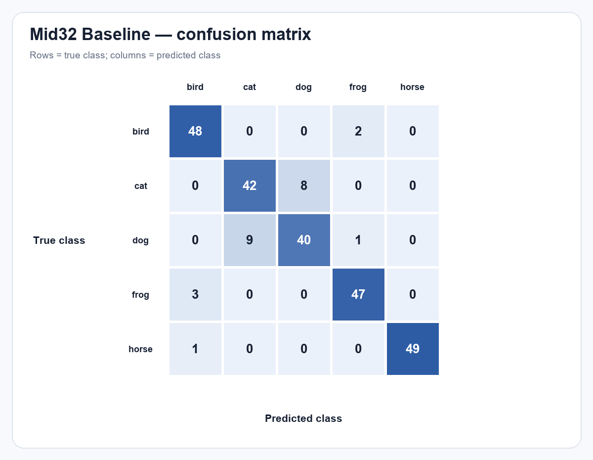
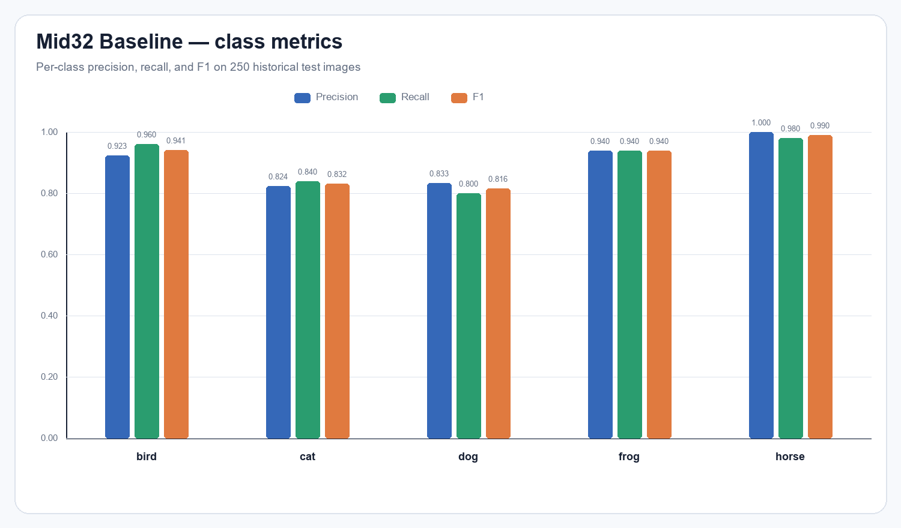
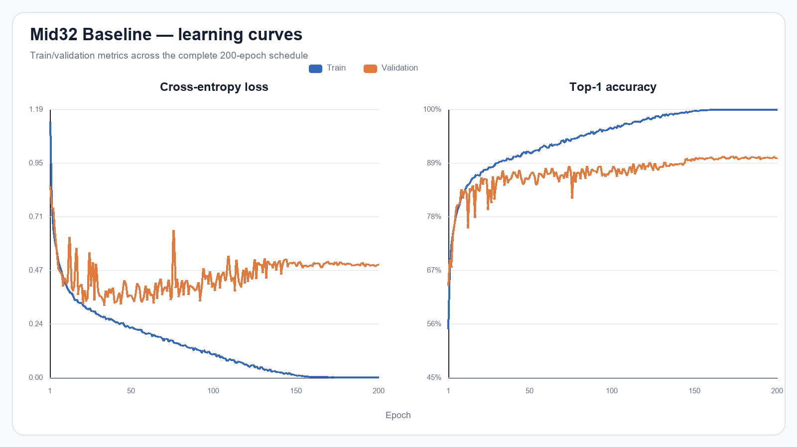

# mid32_baseline_seed42

Run này là **Baseline** trên **Mid32**, seed 42. Checkpoint đánh giá là `best_val.pt`, được chọn hoàn toàn bằng validation tại epoch **173**.

## Kết quả chính

| Chỉ số | Giá trị |
| --- | ---: |
| Validation Top-1 | 90.40% |
| Validation loss | 0.500445 |
| Test Top-1 | **90.40%** (226/250) |
| Test loss | 0.405454 |
| Test Macro-F1 | **0.903817** |
| Learnable parameters | 1,096,260 |
| FLOPs | 157,820,864 (0.157821 GFLOPs) |
| Architecture revision | `ticknet-l-v1` |

## Precision, recall và F1 theo lớp

| Lớp | Precision | Recall | F1 | Support |
| --- | --- | --- | --- | --- |
| bird | 0.9231 | 0.9600 | 0.9412 | 50 |
| cat | 0.8235 | 0.8400 | 0.8317 | 50 |
| dog | 0.8333 | 0.8000 | 0.8163 | 50 |
| frog | 0.9400 | 0.9400 | 0.9400 | 50 |
| horse | 1.0000 | 0.9800 | 0.9899 | 50 |

Các nhầm lẫn xuất hiện nhiều nhất:

- `dog` → `cat`: 9 ảnh
- `cat` → `dog`: 8 ảnh
- `frog` → `bird`: 3 ảnh

## Tệp bằng chứng

- `test_metrics.json`: kết quả do CLI evaluation chính thức sinh ra.
- `predictions.csv`: 250 dự đoán, đường dẫn đã chuẩn hóa tương đối để không phụ thuộc máy chạy.
- `confusion_matrix.csv`: ma trận có nhãn hàng/cột.
- `classification_report.csv`: precision/recall/F1/support được tính từ confusion matrix.
- Checkpoint và log huấn luyện gốc nằm tại `../../checkpoints/mid32_baseline_seed42/`.

Lưu ý: đây là split test lịch sử đã từng được quan sát trong đồ án, không phải một test set độc lập mới.
