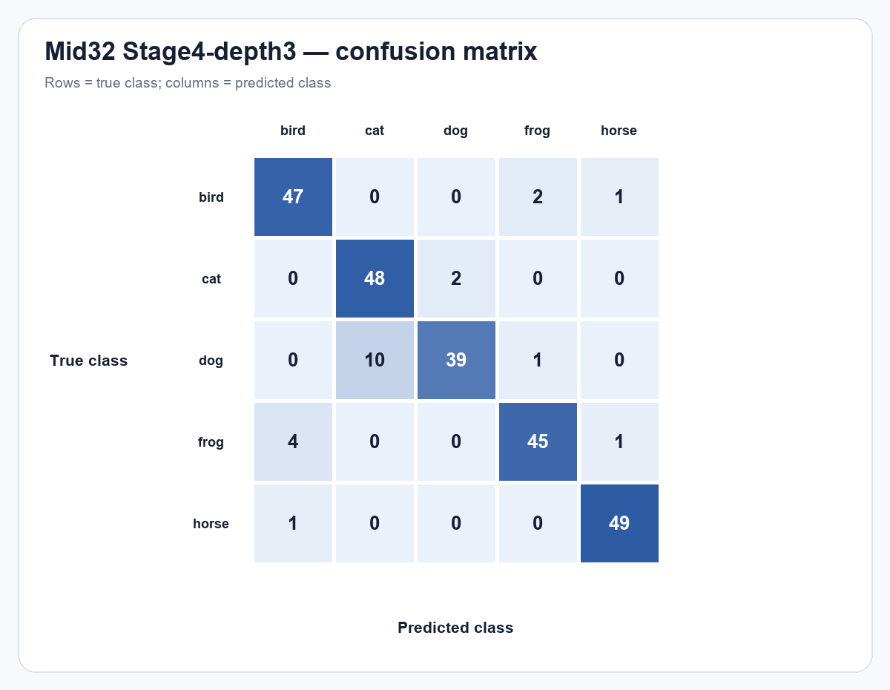
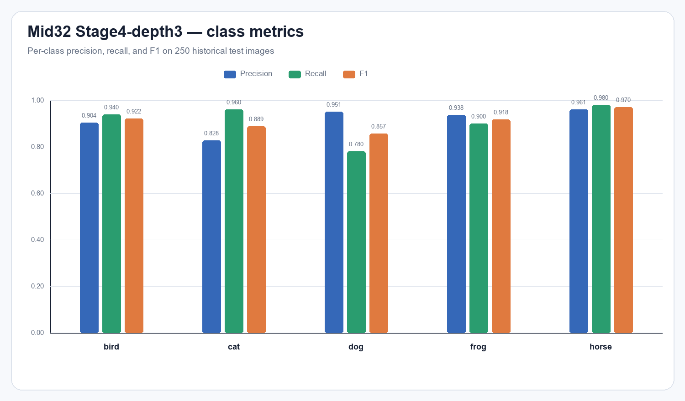
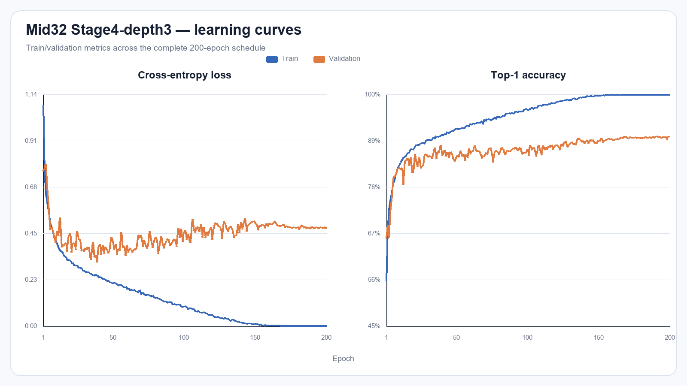

# mid32_experiment_seed42

Run này là **Stage4-depth3** trên **Mid32**, seed 42. Checkpoint đánh giá là `best_val.pt`, được chọn hoàn toàn bằng validation tại epoch **200**.

## Kết quả chính

| Chỉ số | Giá trị |
| --- | ---: |
| Validation Top-1 | 90.12% |
| Validation loss | 0.478256 |
| Test Top-1 | **91.20%** (228/250) |
| Test loss | 0.465283 |
| Test Macro-F1 | **0.911253** |
| Learnable parameters | 1,236,030 |
| FLOPs | 174,236,864 (0.174237 GFLOPs) |
| Architecture revision | `ticknet-l-v1-stage4-depth3` |

## Precision, recall và F1 theo lớp

| Lớp | Precision | Recall | F1 | Support |
| --- | --- | --- | --- | --- |
| bird | 0.9038 | 0.9400 | 0.9216 | 50 |
| cat | 0.8276 | 0.9600 | 0.8889 | 50 |
| dog | 0.9512 | 0.7800 | 0.8571 | 50 |
| frog | 0.9375 | 0.9000 | 0.9184 | 50 |
| horse | 0.9608 | 0.9800 | 0.9703 | 50 |

Các nhầm lẫn xuất hiện nhiều nhất:

- `dog` → `cat`: 10 ảnh
- `frog` → `bird`: 4 ảnh
- `cat` → `dog`: 2 ảnh

## Tệp bằng chứng

- `test_metrics.json`: kết quả do CLI evaluation chính thức sinh ra.
- `predictions.csv`: 250 dự đoán, đường dẫn đã chuẩn hóa tương đối để không phụ thuộc máy chạy.
- `confusion_matrix.csv`: ma trận có nhãn hàng/cột.
- `classification_report.csv`: precision/recall/F1/support được tính từ confusion matrix.
- Checkpoint và log huấn luyện gốc nằm tại `../../checkpoints/mid32_experiment_seed42/`.

Lưu ý: đây là split test lịch sử đã từng được quan sát trong đồ án, không phải một test set độc lập mới.
