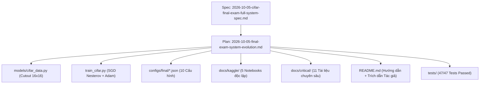

# Superpowers Artifacts: Deep Learning Final Examination

Thư mục này quản lý toàn bộ các tài liệu đặc tả thiết kế kỹ thuật (**Specs**) và kế hoạch hành động (**Plans**) cho hệ thống mô hình `TickNet-L v1` và `TickNet-Basic` phục vụ Đồ án Cuối kỳ.

**Hiện hành:** [CIFAR/Kaggle reliability v2](specs/2026-10-05-cifar-kaggle-reliability.md),
[hướng dẫn Phase 1–4](../kaggle/README.md) và [bằng chứng kiểm thử](../kaggle/VALIDATION.md).
Các bảng/checkbox v1 bên dưới là hồ sơ triển khai lịch sử; không xác nhận đã hoàn thành
thực nghiệm 200 epochs, báo cáo PDF hay toàn bộ đề thi.

Toàn bộ tài liệu tuân thủ chuẩn của quy trình phát triển dựa trên kế hoạch (**Plan-Driven Development**) và được cập nhật đầy đủ theo tiến độ thực tế ngày **2026-10-05**.

---

## 1. Danh Mục Thiết Kế Kỹ Thuật (Specs)

| Tập tin đặc tả | Mô tả nội dung cốt lõi | Trạng thái |
| :--- | :--- | :---: |
| [`specs/2026-10-05-cifar-final-exam-full-system-spec.md`](specs/2026-10-05-cifar-final-exam-full-system-spec.md) | **Đặc tả toàn diện hệ thống:** Tích hợp kỹ thuật Cutout 16x16 (DeVries & Taylor 2017), SGD Nesterov momentum $\mu=0.9$, ma trận 10 file cấu hình (8 Grid Search + 2 Author Baseline), module hóa 5 notebook Kaggle, tái cấu trúc 11 tài liệu kỹ thuật và bảo tồn trích dẫn học thuật của tác giả gốc. | **Hoàn thành** |
| [`specs/2026-10-05-cifar-grid-search-design.md`](specs/2026-10-05-cifar-grid-search-design.md) | Đặc tả ban đầu về cơ chế Grid Search cho `train_cifar.py` và chiến lược phân tầng Stratified 90/10 trên CIFAR-10 & CIFAR-100. | **Hoàn thành** |

---

## 2. Danh Mục Kế Hoạch Triển Khai (Plans)

| Tập tin kế hoạch | Mục tiêu triển khai | Nhiệm vụ đã hoàn thành |
| :--- | :--- | :---: |
| [`plans/2026-10-05-final-exam-system-evolution.md`](plans/2026-10-05-final-exam-system-evolution.md) | **Kế hoạch hành động toàn diện:** Theo dõi chi tiết 8 nhóm nhiệm vụ lớn (Cutout, Nesterov, 10 Configs, 5 Notebooks Kaggle, 11 Docs Critical, README Overhaul & Citation, 47/47 Tests Passed, Git Sync). | **8/8 Tasks (100%)** |
| [`plans/2026-10-05-cifar-grid-search.md`](plans/2026-10-05-cifar-grid-search.md) | Kế hoạch triển khai ban đầu cho module `train_cifar.py` và 8 file cấu hình. | **5/5 Tasks (100%)** |
| [`plans/2026-10-05-cifar-dataloaders.md`](plans/2026-10-05-cifar-dataloaders.md) | Kế hoạch triển khai ban đầu cho `models/cifar_data.py` và script tải dữ liệu `download_cifar.py`. | **3/3 Tasks (h? s? v1)** |

---

## 3. Bản Đồ Liên Kết Hệ Thống (System Linkages)

