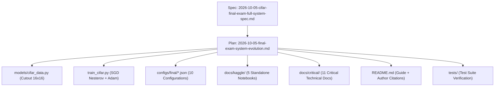

# Superpowers Artifacts: Deep Learning Final Examination

This directory manages all technical design specifications (**Specs**) and execution plans (**Plans**) for the `TickNet-L v1` and `TickNet-Basic` model architectures supporting the Final Examination project.

**Current Active Guidelines:** [CIFAR/Kaggle Reliability v2 Spec](specs/2026-10-05-cifar-kaggle-reliability.md), [Phase 1–4 Guide](../kaggle/README.md), and [Test Verification Evidence](../kaggle/VALIDATION.md).
The v1 tables and checklists below represent historical implementation records; they do not attest to completion of full 200-epoch training runs, final PDF reports, or the overall examination defense.

All documentation conforms to plan-driven development standards and reflects the state as of **2026-10-05**.

---

## 1. Technical Design Specifications (Specs)

| Specification File | Core Focus | Status |
| :--- | :--- | :---: |
| [`specs/2026-10-05-cifar-final-exam-full-system-spec.md`](specs/2026-10-05-cifar-final-exam-full-system-spec.md) | **Comprehensive System Specification:** Integration of Cutout 16×16 (DeVries & Taylor 2017), SGD with Nesterov momentum $\mu=0.9$, 10 configuration files matrix (8 Grid Search + 2 Author Baseline), 5 modularized Kaggle notebooks, restructuring of 11 critical technical documents, and restoration of author citations. | **Completed** |
| [`specs/2026-10-05-cifar-kaggle-reliability.md`](specs/2026-10-05-cifar-kaggle-reliability.md) | Current active specification for Kaggle execution reliability, recovery zip bundles, preflight CPU tests, atomic checkpointing, and artifact validation. | **Active / Current** |
| [`specs/2026-10-05-cifar-grid-search-design.md`](specs/2026-10-05-cifar-grid-search-design.md) | Initial technical design specification for the grid search mechanics in `train_cifar.py` and 90/10 stratified dataset partitioning on CIFAR-10 & CIFAR-100. | **Completed (Historical)** |

---

## 2. Implementation Plans (Plans)

| Implementation Plan | Objective | Tasks Completed |
| :--- | :--- | :---: |
| [`plans/2026-10-05-final-exam-system-evolution.md`](plans/2026-10-05-final-exam-system-evolution.md) | **System Evolution Master Plan:** Tracking 8 major task groups (Cutout, Nesterov, 10 Configs, 5 Kaggle Notebooks, 11 Critical Docs, README Overhaul & Citation, Unit Tests, Git Synchronization). | **8/8 Tasks (100%)** |
| [`plans/2026-10-05-cifar-grid-search.md`](plans/2026-10-05-cifar-grid-search.md) | Initial implementation plan for `train_cifar.py` and 8 grid search configuration files. | **5/5 Tasks (100%)** |
| [`plans/2026-10-05-cifar-dataloaders.md`](plans/2026-10-05-cifar-dataloaders.md) | Initial implementation plan for `models/cifar_data.py` and automated dataset downloader `scripts/download_cifar.py`. | **3/3 Tasks (v1 record)** |

---

## 3. System Architecture and Dependency Map

