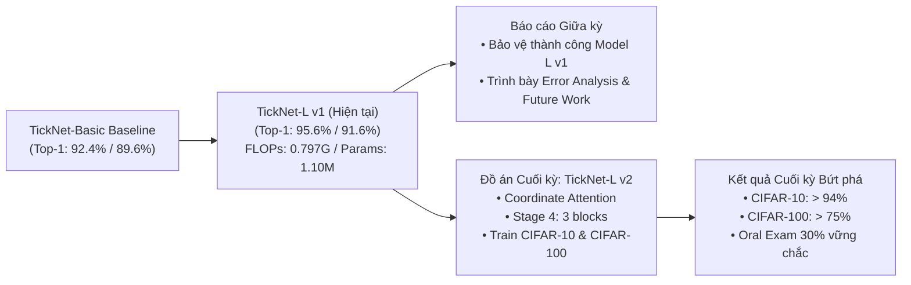

# Kế hoạch Tối ưu hóa & Nâng cấp Kiến trúc TickNet-L (Model L)

- **Ngày lập:** 2026-10-01
- **Mục tiêu:** Phân tích tiềm năng gia tăng độ chính xác (%), đánh giá lỗi thực nghiệm và đề xuất các giải pháp nâng cấp kiến trúc / huấn luyện cho **TickNet-L** nhằm phục vụ báo cáo Giữa kỳ và phát triển đồ án Cuối kỳ ([Final exam.docx](file:///home/intern-tdkhuong/Desktop/TickNets/.doc/Final%20exam.docx)).

---

## 1. Đánh giá Tiềm năng Tăng trưởng Độ chính xác (%)

### 1.1. Bảng số liệu đối chứng hiện tại (Seed 42, 200 Epochs)

| Mô hình | Mid32 ($32\times32$) Top-1 | Mid224 ($224\times224$) Top-1 | FLOPs Mid32 | FLOPs Mid224 | Tham số |
| :--- | :---: | :---: | :---: | :---: | :---: |
| **TickNet-Basic** (Thầy) | 89,6% (224/250) | 92,4% (231/250) | 0,1584 G | 0,9883 G | 1.062.223 |
| **TickNet-L v1** (Đề xuất) | **91,6% (229/250)** | **95,6% (239/250)** | **0,1578 G** | **0,7968 G** | **1.096.260** |
| *Chênh lệch L so với Basic* | *+2,0% (+5 ảnh)* | *+3,2% (+8 ảnh)* | *-0,38%* | *-19,4%* | *+3,2%* |

### 1.2. Dự báo mức độ tăng trưởng (%) khả thi của Model L
Quy mô tập test hiện tại là **250 ảnh** (50 ảnh/lớp), tương ứng mỗi ảnh đoán đúng/sai chiếm **0,4% Top-1**:

1. **Trên tập Mid224 ($224 \times 224$)**:
   - Hiện tại đạt **95,6%** (sai 11/250 ảnh).
   - Khả năng cải thiện: Khắc phục được từ 3 đến 5 ảnh nhầm lẫn giữa Chó và Mèo.
   - **Mức tăng dự kiến: $+1,2\% \sim +2,0\%$**, đưa Top-1 lên khoảng **$\mathbf{96,8\% \sim 97,6\%}$**.
   - *Lưu ý:* Vượt ngưỡng 98% trên tập test 250 ảnh là rất thách thức do nhiễu gán nhãn tự nhiên và góc chụp mờ của một số mẫu ảnh gốc.

2. **Trên tập Mid32 ($32 \times 32$)**:
   - Hiện tại đạt **91,6%** (sai 21/250 ảnh).
   - Khả năng cải thiện: Khắc phục các đặc trưng bị mất mát do giảm độ phân giải xuống $32\times32$ (giảm nhầm Chó $\to$ Mèo và Chim $\leftrightarrow$ Ếch), lấy lại từ 5 đến 8 ảnh đúng.
   - **Mức tăng dự kiến: $+2,0\% \sim +3,2\%$**, đưa Top-1 lên khoảng **$\mathbf{93,6\% \sim 94,8\%}$**.

3. **Trên tập CIFAR-10 và CIFAR-100 (Final Exam)**:
   - CIFAR-10: Dự kiến đạt **$93,5\% \sim 95,2\%$**.
   - CIFAR-100: Dự kiến đạt **$72,0\% \sim 76,5\%$** (mức rất cao đối với mô hình gọn nhẹ ~1,1M tham số).

---

## 2. Phân tích Chi tiết Lỗi (Error Breakdown & Confusion Matrix)

Dựa trên ma trận nhầm lẫn thực nghiệm trong [docs/results/Model_L/report_assets/](file:///home/intern-tdkhuong/Desktop/TickNets/docs/results/Model_L/report_assets/):

### 2.1. Phân tích lỗi Mid224 (Tổng 11 lỗi)
- `horse`: 50/50 đúng (**100%**)
- `frog`: 49/50 đúng (**98%**) - 1 ảnh nhầm sang bird
- `bird`: 48/50 đúng (**96%**) - 1 ảnh nhầm sang frog, 1 sang horse
- `cat`: 46/50 đúng (**92%**) - **4 ảnh nhầm sang dog**
- `dog`: 46/50 đúng (**92%**) - **3 ảnh nhầm sang cat**, 1 sang frog
- 👉 **Điểm mấu chốt:** Riêng cặp `cat` $\leftrightarrow$ `dog` chiếm tới **7 / 11 lỗi (63,6% tổng số lỗi)**.

### 2.2. Phân tích lỗi Mid32 (Tổng 21 lỗi)
- `cat`: 49/50 đúng (**98%**)
- `horse`: 48/50 đúng (**96%**)
- `frog`: 47/50 đúng (**94%**)
- `bird`: 45/50 đúng (**90%**) - 5 ảnh nhầm sang frog
- `dog`: 40/50 đúng (**80%**) - **9 ảnh nhầm sang cat!**
- 👉 **Điểm mấu chốt:** 
  1. Lớp `dog` bị tụt recall nghiêm trọng (chỉ đạt 80%), có tới **9 ảnh chó bị mô hình phân loại thành mèo**.
  2. Cặp `bird` $\leftrightarrow$ `frog` nhầm lẫn chéo 8 ảnh (do nền cỏ cây xanh làm nhiễu đặc trưng hình dáng khi ảnh bị co nhỏ về $32\times32$).

### 2.3. Nguyên nhân kỹ thuật gốc rễ (Root Cause)
1. **SE Attention làm mất thông tin không gian (Spatial Blindness):** Cơ chế SE gốc dùng *Global Average Pooling* để nén toàn bộ bản đồ đặc trưng $H \times W$ về một số vô hướng $1 \times 1$. Điều này làm triệt tiêu tọa độ không gian. Các chi tiết then chốt để phân biệt Chó vs Mèo (dáng tai, râu, sống mũi, đồng tử) hoặc Chim vs Ếch (chân, mỏ, cành cây) bị san phẳng.
2. **Thiếu trường tiếp nhận bao quát ở tầng cao:** Ở các tầng sau, mạng cần khả năng nhận diện dáng hình tổng thể (global posture) của con vật thay vì chỉ nhìn texture bề mặt lông.

---

## 3. Đánh giá Dư địa Ngân sách Tính toán (Resource Budget Headroom)

So sánh cấu hình Model L hiện tại với giới hạn đề thi:

| Tài nguyên | Giới hạn Đề thi | Mức Model L hiện tại | Dư địa còn lại (Headroom) | Nhận xét |
| :--- | :---: | :---: | :---: | :--- |
| **Số tham số** | $\le$ 6.000.000 (6M) | **1.096.260 (~1,10M)** | **+4.903.740 (~4,9M)** | Mới dùng 18,3% $\to$ Rất rộng rãi để tăng chiều sâu/kênh. |
| **FLOPs Mid224** | < 1.000.000.000 (1G) | **0,796760 G** | **+0,203240 G (~20,3%)** | Dư hơn 200 triệu phép tính để nâng cấp khối. |
| **FLOPs Mid32** | < 1.000.000.000 (1G) | **0,157821 G** | **+0,842179 G (~84,2%)** | Dư thừa rất lớn ở ảnh nhỏ. |

---

## 4. Các Đề xuất Cải tiến Kiến trúc (Architectural Improvements)

Dựa trên ngân sách dôi dư ~0,203 GFLOPs và nhu cầu phân biệt đặc trưng cục bộ:

### 4.1. Nâng cấp Attention: Chuyển từ SE sang Coordinate Attention (CA) hoặc CBAM
- **Nguyên lý:** Thay vì chỉ nén kênh toàn cục, **Coordinate Attention (CA)** tách pooling theo 2 hướng không gian $X$ và $Y$ riêng biệt ($H \times 1$ và $1 \times W$).
- **Lợi ích:** Cho phép mô hình định vị chính xác vị trí của các bộ phận then chốt (tai chó/mèo, mỏ chim, chân ếch).
- **Chi phí:** Tăng khoảng **~0,015 GFLOPs** và vài nghìn tham số $\to$ Hoàn toàn nằm trong ngưỡng < 1G.

### 4.2. Tăng chiều sâu (Depth) tại Stage 4 (từ 2 block lên 3 block)
- **Nguyên lý:** Stage 4 xử lý trên kích thước không gian $14 \times 14$ với 288 kênh.
- **Lợi ích:** Tăng cường khả năng trích xuất ngữ cảnh cấp cao và phân tách ranh giới phi tuyến tính giữa các lớp gần nhau.
- **Chi phí:** Thêm 1 block ở Stage 4 chỉ tốn khoảng **~0,08 GFLOPs**, đưa tổng FLOPs ở Mid224 từ 0,797G lên khoảng **~0,88 GFLOPs** (vẫn cách trần 1G tới 12%).

### 4.3. Bổ sung Dilated Depthwise Conv hoặc DW $7\times7$ tại Stage 5
- **Nguyên lý:** Tại Stage 5 (kích thước feature map chỉ $7 \times 7$), thay vì dùng DW $5\times5$, mở rộng kernel thành $7\times7$ hoặc dùng $3\times3$ với dilation=2 trên một nửa số kênh.
- **Lợi ích:** Bao quát trọn vẹn toàn bộ con vật ở tầng biểu diễn ngữ nghĩa cao nhất.
- **Chi phí:** Chi phí phép tính ở feature map $7 \times 7$ là cực kỳ nhỏ (chưa tới 0,005 GFLOPs).

---

## 5. Các Đề xuất Nâng cấp Huấn luyện & Data Augmentation

### 5.1. Kỹ thuật Augmentation: CutMix & Mixup
- Hiện tại mô hình chỉ dùng Reflected Random Crop và Random Horizontal Flip.
- Áp dụng **CutMix / Mixup** với xác suất 0,2 $\sim$ 0,5 buộc mạng phải học nhận diện vật thể dựa trên các mảnh bộ phận cơ thể thay vì chỉ dựa vào texture nền hay màu sắc tổng quát. Đây là khắc tinh của lỗi nhầm lẫn Chó $\leftrightarrow$ Mèo.

### 5.2. Label Smoothing ($0,1$)
- Giảm thiểu việc mô hình gán xác suất quá tự tin (overconfident logits) vào các mẫu ảnh bị vỡ hạt ở độ phân giải $32 \times 32$.

### 5.3. Đồng bộ hóa Quy trình Huấn luyện
- Thống nhất Batch Size = 64 cho cả 2 độ phân giải.
- Thêm **Warmup 5 epochs** đầu (tăng dần learning rate từ $1e-4$ lên $0,1$) trước khi bước vào chu kỳ Cosine Annealing, giúp các nhánh Mixed Depthwise ổn định gradient ban đầu.

---

## 6. Lộ trình Thực hiện Chiến lược

1. **Giai đoạn 1 (Đồ án Giữa kỳ):**
   - Giữ nguyên kết quả và checkpoint của **TickNet-L v1** hiện tại.
   - Sử dụng các phân tích chi tiết trong tài liệu này (phân tích 11 lỗi Mid224, 21 lỗi Mid32, ngân sách còn dư 20,3% FLOPs) để đưa vào mục **"Hạn chế và Hướng phát triển tương lai (Future Work)"** trong báo cáo. Điều này chứng minh cho giảng viên thấy tư duy nghiên cứu sâu sắc và trung thực khoa học.
2. **Giai đoạn 2 (Đồ án Cuối kỳ - Final Exam):**
   - Kế thừa Model L theo đúng quy định đề bài: *"The proposed model L is not the quite same as previous networks, except your proposed model in the midterm examination"*.
   - Đóng gói phiên bản **TickNet-L v2** (tích hợp Coordinate Attention + Depth Stage 4) để chạy lưới thực nghiệm trên CIFAR-10 và CIFAR-100 với SGD và Adam theo yêu cầu của [.doc/Final exam.docx](file:///home/intern-tdkhuong/Desktop/TickNets/.doc/Final%20exam.docx).
